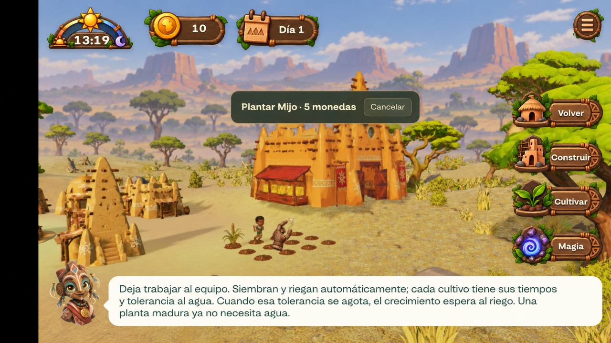

# Wild Guardians — Far Vegetation Impostor System

Especificación solicitada por el usuario el 5 de octubre de 2026. Estado: **prototipo aislado iniciado; primer atlas precalculado**. [Atlas de acacia y pruebas](qa/far-vegetation-atlas/README.md); [primer visor aislado de billboard y transición](qa/far-vegetation-transition/README.md). No acredita integración en gameplay ni éxito del sistema completo. Las distancias y resoluciones de ejemplo son experimentales.

## 1. Objetivo

Representar mediante impostores 2D los árboles más allá de la distancia normal de chunks. El objetivo principal es reducir vacío y popping del horizonte, no aumentar el rendimiento del render actual. Debe ampliarse la vegetación visible sin cargar GLB completos ni chunks de alta resolución.

Muy lejos e intermedio: impostor. Transición: impostor y modelo 3D. Cerca: modelo 3D. El cambio debe ser difícil de percibir durante el movimiento normal de cámara.

## 2. Separación de datos y representación

Separar árbol lógico/procedural, visual lejano y visual cercano. El árbol lejano solo necesita X/Z, Y aproximada, tipo, escala, orientación procedural e ID/seed. No necesita GLB, collider, física, sombras individuales complejas, comportamiento, animación, lógica de gameplay ni chunk completo.

La misma seed y reglas del mundo deben permitir conocer árboles de chunks todavía no cargados.

## 3. Assets precalculados

No generar texturas de árboles durante gameplay. Generar previamente un atlas por tipo con ocho vistas horizontales: 0°, 45°, 90°, 135°, 180°, 225°, 270° y 315°.

Todas las vistas deben compartir exactamente encuadre, escala, árbol centrado y coordenada vertical de la base del tronco. Fondo transparente, alpha conservado e iluminación neutra, sin luz direccional fuerte horneada.

Comenzar experimentalmente con 256 × 256 px por vista, sin fijarlo como resolución definitiva. Comparar posteriormente cuatro vistas si ocho no aportan una mejora perceptible a la distancia utilizada.

## 4. Billboard cilíndrico

Plano vertical que gira continuamente hacia la cámara solo alrededor de Y. Su dirección frontal es la dirección horizontal árbol → cámara, ignorando diferencias de altura. No inclinarlo al mirar desde arriba/abajo ni orientar el plano simplemente con la rotación procedural original.

## 5. Vista del atlas y orientación lógica

Conservar por árbol su rotación Y procedural. Calcular `relativeAngle = cameraAngleAroundTree - treeWorldRotation`, normalizado a 0–360°. Para ocho vistas, selección discreta: `viewIndex = round(relativeAngle / 45°) mod 8`.

Dos árboles del mismo tipo con rotaciones diferentes pueden mostrar caras diferentes desde una misma cámara. Verificar la convención angular y ausencia de inversiones.

## 6. Cambio angular suave

Preferir interpolar las dos vistas adyacentes para evitar popping angular. A 30° relativos: aproximadamente 33 % de la vista 0° y 67 % de la vista 45°, mediante mezcla de muestras del atlas.

Comparar experimentalmente ocho vistas discretas frente a interpoladas si el coste/complejidad resulta excesivo. No asumir que la mezcla es necesaria si el cambio no se percibe a las distancias reales.

## 7. Iluminación global

Actualización del usuario (6 de octubre): comparar primero atlas de **día y noche precocinados desde el modelo con shader real**, sin normales ni iluminación compleja en el impostor. Esta indicación sustituye la preferencia inicial de no hornear fases. El sol conserva su dirección: solo hay transición día/noche, por lo que se puede hornear la iluminación para las orientaciones del árbol respecto a ese sol fijo. Distinguir la rotación procedural del árbol de la vista de cámara; el prototipo ampliado captura ocho orientaciones del árbol por ocho vistas de cámara, en ambas fases. Mantener mezcla suave, fog y dithering. Comprobar visualmente la interpolación entre ángulos/fases y las cámaras elevadas antes de integrar; dos extremos horneados no demuestran por sí solos equivalencia exacta en toda la transición. [Prototipo inicial](qa/far-prelit-atlas/README.md) y [orientaciones respecto al sol](qa/far-prelit-rotations/README.md).

Referencia de la alternativa inicial: El atlas neutro debe recibir como mínimo `finalColor = impostorColor × globalLighting`, incluyendo color/intensidad día-noche, tinte ambiental, fog/perspectiva atmosférica y filtros globales relevantes del bioma.

Debe seguir aproximadamente el oscurecimiento/azulado nocturno de los modelos. Se prioriza coherencia perceptual sobre equivalencia física exacta.

## 8. Normales opcionales

Primera prueba: RGB + alpha + iluminación global simplificada. No implementar normal maps inicialmente. Solo si la transición resulta demasiado plana, experimentar con normales precalculadas, aproximadas o iluminación hemisférica simple.

## 9. Rangos configurables

Exponer parámetros equivalentes a `MODEL_FULL_DISTANCE`, `TRANSITION_START`, `TRANSITION_END` e `IMPOSTOR_MAX_DISTANCE`; no fijar valores definitivos en código.

Ejemplo experimental: 0–250 m modelo; 250–300 m transición; 300–1000+ m impostor; al extremo lejano desaparición progresiva mediante fog. Ajustar a la escala real del mundo.

## 10. Transición bidireccional

Nunca sustituir instantáneamente impostor OFF → modelo ON. Mantener una banda de transición que funcione al acercarse y alejarse. Ejemplo: 300 m impostor 100 % / modelo 0 %; 275 m ambos 50 %; 250 m impostor 0 % / modelo 100 %.

## 11. Dithering de LOD

Preferir crossfade con dithering/screen-door frente a transparencia alpha tradicional. Usar `lodFade` entre 0 y 1: modelo `1 - transitionFactor`, impostor `transitionFactor`.

Descartar píxeles con patrón estable en pantalla o mundo, evitando parpadeo temporal evidente, problemas de orden y doble imagen. Conservar materiales opacos/alpha-tested y reutilizar un mecanismo equivalente del motor si existe.

## 12. Coincidencia espacial

Durante la transición compartir exactamente base, altura, escala y orientación lógica, con dimensiones visuales aproximadamente iguales. El billboard usa pivote inferior centrado (`bottom-center`): la base coincide con el contacto del tronco con el terreno. No centrarlo verticalmente sobre la posición del árbol ni permitir que flote/se desplace.

## 13. Escala derivada del modelo

Guardar `impostorWidth` e `impostorHeight` por especie según dimensiones reales del modelo y multiplicarlas por `treeProceduralScale`. Una escala procedural 1,2 debe ampliar modelo e impostor en la misma proporción.

## 14. Chunk cargando detrás del impostor

La visual lejana es independiente del estado de carga del chunk real. Al acercarse, cargar/generar el chunk y preparar el modelo equivalente; entonces efectuar crossfade y retirar el impostor cuando termine.

No quitarlo por el simple hecho de terminar la carga del chunk. Si el modelo tarda, mantener temporalmente la representación simplificada para evitar vacío.

## 15. Correspondencia determinista

Evitar que el impostor se sustituya por un árbol distinto/desplazado. Compartir ID, posición, especie, escala y rotación entre ambas representaciones. ID propuesto: `hash(worldSeed, chunkCoordinate, localTreeIndex)`.

Solo cambia la representación, no el árbol lógico.

## 16. Terreno sin generar

Obtener Y directamente de la función procedural de altura, por ejemplo `sampleTerrainHeight(worldX, worldZ)`, sin construir el chunk completo. Consultar altura, bioma, densidad y tipo de árbol con datos ligeros.

## 17. Densidad lejana determinista

Exponer `farVegetationDensityMultiplier`: 1,0 todos; 0,5 aproximadamente la mitad; 0,25 aproximadamente una cuarta parte. Seleccionar mediante seed/hash estable, nunca aleatoriamente cada frame.

Lejos importan siluetas, densidad aparente y masas vegetales. No es obligatorio representar el 100 % ni exigir correspondencia perfecta de todos los árboles; los seleccionados que lleguen a transición sí deben coincidir con árboles reales.

## 18. Perspectiva atmosférica

Mezclar progresivamente el color del árbol con el horizonte según distancia/fog. Reducir contraste, aproximar al cielo/horizonte y reducir saturación si encaja con el shader actual. Ocultar resolución limitada, planaridad, cambios angulares y simplificación de iluminación.

## 19. Extremo lejano progresivo

No cortar abruptamente en `IMPOSTOR_MAX_DISTANCE`. Desvanecer en una banda A–B hacia la niebla del horizonte, evitando un borde circular visible de vegetación.

## 20. Muchos impostores

Preferir instancing/batching, con material/atlas por especie o conjunto, frente a renderables costosos independientes por árbol. Datos aproximados por instancia: posición, escala, rotación lógica, índice de atlas/especie, fade y seed/variación opcional.

Investigar billboard y selección angular en shader para reducir trabajo CPU. Medir CPU, GPU, RAM y tamaño distribuido; el horizonte adicional debe tener un coste pequeño.

## 21. Sombras

Inicialmente los impostores no proyectan sombras dinámicas. El modelo cercano recupera las suyas. Si la aparición resulta visible, introducirlas progresivamente con el modelo. No generar shadow maps para miles de árboles lejanos.

## 22. Primera prueba aislada y validación

Un único árbol de Sabana, atlas de ocho vistas, varios ejemplares repetidos, cámara móvil, billboard Y, selección angular, transición 3D/impostor, luz global y fog. No integrar inmediatamente todos los biomas.

- **A — rotación:** órbita lenta; plano orientado a cámara, orientación procedural conservada, vistas correctas, sin inversión izquierda/derecha.
- **B — aproximación:** acercar y alejar; sin saltos de escala/altura/silueta y con crossfade estable.
- **C — movimiento lateral:** pasar junto a varios árboles para detectar planaridad.
- **D — luz:** amanecer, mediodía, atardecer y noche; modelos e impostores pertenecen perceptualmente a la misma escena.
- **E — horizonte:** cientos/miles de impostores más allá de los chunks actuales; comprobar que el mundo deja de parecer cortado.

## 23. Criterios de éxito

1. En gameplay normal no se distingue fácilmente el límite 3D/impostor.
2. Acercarse no provoca popping evidente al sustituirlo por el modelo.
3. Orbitar no revela una lámina evidente.
4. El horizonte conserva vegetación aunque los chunks reales no estén cargados.
5. CPU/GPU/RAM permiten ampliar sustancialmente la distancia visual con coste suficientemente pequeño.
6. No aumenta significativamente el tamaño final del juego.

Registrar pruebas visuales y medidas antes de declarar éxito. La integración general depende de esa validación.

## 24. Prioridad visual

Priorizar silueta, tamaño, posición, color, densidad y coherencia atmosférica: que el jugador no perciba la sustitución. No perseguir equivalencia perfecta ni detalles que ocupan pocos píxeles.

## 25. Segunda fase condicionada

Solo tras validar árboles, estudiar arbustos, vegetación característica, rocas grandes, edificios lejanos, formaciones geológicas, atlas multiespecie, normales, LOD ultralejano o terreno simplificado.

El primer objetivo sigue siendo ocultar visualmente el borde de generación de chunks mediante árboles impostores, sin introducir un coste importante.

Avance experimental: [horizonte de mil acacias adicionales medido](qa/far-vegetation-horizon/README.md), ocho lotes nativos, cinco pruebas dirigidas y selección cercana sin reconstrucción con cámara quieta. Coste incremental GPU aproximado de 0,49 ms en este visor; todavía fuera de gameplay, sin acreditar móvil, RAM o integración procedural/iluminación real.

Avance experimental de iluminación: [modelo con material real y atlas con grading artístico compartido](qa/far-vegetation-lighting/README.md), cuatro fases del reloj, comparación a cámara fija y ocho lotes GPU. Persisten diferencias de contraste/detalle y el coste requiere más evaluación; no se activa en gameplay ni acredita la transición final.

## Referencia visual adicional — paisaje por capas (6 de octubre de 2026)

Referencia para la continuación del experimento, no captura del juego ni prueba de implementación. Original recibido: `12289.jpg`. El encuadre, masas vegetales, pérdida progresiva de contraste y profundidad atmosférica son el objetivo visual. El HUD, texto y precios presentes en la ilustración no sustituyen las reglas actuales del juego.

- **Primer plano:** mantener los modelos y terreno en 3D; experimentar con una distancia cercana ligeramente menor que la actual, solo si el cambio visual queda oculto y las medidas lo justifican.
- **Planos medios/lejanos:** vegetación y, después de validar árboles, otros assets 2D situados según la misma semilla, altura, especie, escala y orientación lógica que su representación cercana. No distribuirlos como decoración aleatoria de pantalla.
- **Bruma procedural por distancia:** aumentar progresivamente la bruma hacia el horizonte. Mantener algo de ella durante la sustitución 2D/3D y reducirla hasta cero cerca de cámara. Compartir color e iluminación con el bioma y el reloj. Mantener el crossfade/dithering, anclaje inferior y retención del impostor hasta que el modelo esté listo.
- **Suelo lejano:** representación 2D/simplificada del color del suelo 3D, con detalles y contraste lavados. Anclarla al mundo y conservar la coherencia del relieve/altura procedural, especialmente ríos, cañones y volcanes. Comprobar que no flota ni cruza terrenos cercanos y que su sustitución no produce una costura visible. La textura no debe generarse continuamente en gameplay.
- **Último fondo:** montañas 2D en capas con parallax antes del skymap. Reaccionar de forma coherente a la traslación y rotación de cámara; comprobar órbita, cambios de altura, desplazamiento lateral, alineación con el horizonte y ausencia de intersecciones con el relieve real. Compartir bruma y grading día/noche.

### Coste y secuencia

Preferir bruma integrada en los materiales/instancias y muestras de ruido baratas o precalculadas. Evitar introducir una pasada volumétrica costosa sin evidencia de que sea necesaria y cumpla el presupuesto. Medir overdraw, draw calls, frametime CPU/GPU, RAM y tamaño de atlas/texturas; no asumir que 2D o parallax son gratuitos.

Mantener la primera validación aislada de una especie de Sabana. Después integrar sus datos procedurales, suelo lejano, bruma compartida y finalmente montañas por capas; ampliar a otros assets/biomas cuando las pruebas lo permitan. Añadir comparación con distancia 3D actual y ligeramente reducida, aproximación/alejamiento con bruma residual, órbita/lateral/altura y cuatro fases de luz. Validar también en móvil físico antes de adoptar el conjunto. La imagen es una referencia de dirección artística, no una exigencia de equivalencia exacta píxel a píxel.

## Criterio prioritario — exactitud y composición del horizonte (6 de octubre de 2026)

Indicaciones adicionales del usuario, a recuperar al continuar esta fase. Amplían los apartados 17, 18 y 25: **no dibujar mediante billboards todo el procedural lejano ni extrapolar una densidad constante hasta el horizonte**. El propósito es conservar el paisaje abierto y espaciado del concept art, evitando la compresión en perspectiva de cientos de árboles en una pared vegetal. Queda registrado; no se activa ni se implementa por esta actualización documental.

La cadena de representación será:

**3D real → impostores proceduralmente exactos → impostores seleccionados con densidad decreciente → backdrop 2D → skybox.**

1. **Zona cercana, representación exacta.** Mundo procedural real en 3D. Posición, tipo, escala, rotación y demás parámetros corresponden exactamente al generador. Mantener gameplay y accesibilidad reales.
2. **Zona media, impostores fieles.** Los objetos importantes, especialmente árboles grandes, conservan exactamente esos parámetros y el mismo ID que el modelo 3D. Crossfade/dither bidireccional sin desplazamientos, cambios de altura o escala; mantener el impostor hasta que su modelo esté listo. La exactitud espacial no exige representar hierba ni todos los objetos pequeños mediante impostores.
3. **Zona muy lejana, representación paisajística simplificada.** Reducir progresivamente la densidad con la distancia. Seleccionar únicamente elementos visualmente importantes mediante seed/hash estable de objeto o posición; no sortear cada frame ni crear otra distribución espacial arbitraria. Priorizar árboles grandes, masas vegetales significativas, estructuras y elementos que definen la silueta. Hierba, vegetación pequeña, residuos y piedras menores desaparecen mucho antes, con rangos propios.

Al acercarse, la selección simplificada debe converger progresivamente hacia la distribución procedural real. Los objetos omitidos recuperan su representación mediante fade dentro de la perspectiva atmosférica **antes de entrar en la zona fiel**. No sustituir elementos por otros ni moverlos para rellenar huecos. La reducción de densidad debe ser configurable por distancia, importancia/categoría y bioma, conservando la selección determinista; el multiplicador fijo del apartado 17 por sí solo no cumple este requisito.

Después de la vegetación procedural simplificada, usar un **backdrop inaccesible del bioma**: montañas, mesetas, volcanes u otras formaciones 2D por capas con parallax, antes del skybox. Estos elementos son composición del horizonte y no tienen que corresponder a geometría procedural real. Deben distinguirse de los objetos de la zona fiel que sí pueden alcanzarse; no introducir colisiones, rutas o promesas de gameplay a partir del backdrop decorativo. Conservar coherencia de cámara, relieve próximo, bioma, luz y cielo.

La perspectiva atmosférica reduce contraste/saturación e integra los colores con el cielo; puede incluir un ligero blur si procede y su coste se valida. Mantener bruma residual durante el cambio 2D/3D y reducirla a cero cerca. No introducir una pasada costosa o penalizar frametime para ocultar transiciones. Priorizar composición paisajística controlada donde el jugador no puede contrastar el detalle y exactitud donde sí puede hacerlo.

### Validación adicional obligatoria

- Comparar la densidad lejana constante con la curva reducida usando la misma seed/cámara; comprobar masas, silueta y espacios abiertos frente al concept art. No usar «más árboles» como criterio de éxito.
- Revisar varias posiciones, ángulos, alturas y niveles de zoom: que la perspectiva no forme una pared vegetal ni revele franjas o anillos de densidad.
- Acercar/alejar repetidamente: los objetos omitidos aparecen/desaparecen con fade atmosférico y llegan a la zona fiel con el mismo ID/posición/parámetros, sin popping.
- Repetir cámara y seed: misma selección, sin cambios aleatorios entre frames ni parpadeo al variar ligeramente la distancia.
- Verificar categorías: elementos pequeños retirados antes, siluetas importantes presentes, backdrop inaccesible separado del mundo fiel.
- Registrar imágenes y CPU/GPU/RAM/tamaño en cada nivel, incluida la bruma/blur y el overdraw, antes de adoptar la composición.

[Densidad lejana decreciente experimental](qa/far-vegetation-density/README.md): selección determinista por ID/semilla, fade progresivo antes de zona fiel y comparación nativa de ocho lotes. Fondo más abierto y menores medianas GPU en este visor; pendiente integración procedural, movimiento, bruma y móvil. Sigue fuera de gameplay.

[Primera consulta de árboles procedurales exactos](qa/far-vegetation-procedural/README.md): Sabana/acacia, mismos IDs/alturas/giros/escalas de los chunks, sin generar geometría ni vegetación pequeña; anclaje y escala anisotrópica en visor. Igualdad completa de generación normal en seis biomas, 73+15 pruebas, build/paquete y render nativo. Pendiente terreno, bruma, streaming/chunks tardíos y móvil; sigue fuera de gameplay.

Comparación opcional de normales: [evidencia y límites](qa/far-normal-lighting/README.md). No acreditó coste nulo; se conserva únicamente como referencia experimental.

Aclaración del usuario: el sol del juego conserva dirección fija; únicamente cambia la fase día/noche. La limitación del atlas de una sola orientación es el giro procedural del árbol frente a ese sol, no un movimiento solar. Probar atlas con filas de orientación mundial y columnas de vista relativa para ambas fases, y elegir cantidad/resolución tras medir tamaño y GPU.

## Capa regional para la integración nativa (6 de octubre)

`tools/experiments/native-far-layer.js` coordina el worker, los billboards y la cobertura nativa. Todavía no se instancia desde WorldScene: no acredita integración en gameplay. Recibe la escena, el prototipo y texturas prestadas, metadatos y una función explícita de preparación GPU. La región anterior permanece visible hasta completar la preparación de la nueva; resultados obsoletos o fallidos no sustituyen esa región. Se conservan IDs, anclajes anisótropos, estado de transición y supresiones. Al descartarse, restaura la cobertura de color nativa sin modificar la obstrucción lógica y no destruye recursos prestados.

Las consultas `treesOnly` conservan exactamente la generación de acacias, pero omiten los buffers de posiciones, colores e índices del terreno lejano. El worker real confirma 112 árboles idénticos en la región de referencia y cero buffers de suelo transferidos. La receta existente con terreno sigue funcionando.

Validación: 22 pruebas de capa regional, worker, cancelación, cobertura CPU/GPU, reemplazo y limpieza. Falta conectar el ciclo de render de WorldScene, preparar las generaciones GPU durante streaming, comprobar las sombras/obstrucción y realizar la prueba visual en partida. No activar todos los biomas antes de validar Sabana.

### Conexión optativa con WorldScene

La prueba `tests/browser/far-native-world.html` ya conecta el adaptador regional con el WorldScene real de Sabana. Los callbacks de actualización/descarte permanecen inactivos en partidas normales. La prueba valida carga de regiones, preparación GPU, supresiones y limpieza; no constituye aprobación visual del horizonte. [Evidencia y limitaciones](qa/far-native-world/README.md).

La cobertura GPU usa únicamente los chunks dentro del frustum de color y debe ignorar cambios de versiones causados por el propio crossfade para evitar bucles. Los cambios estructurales, de material, anclaje de render y packing nativo sí invalidan la preparación. El suelo regional de baja resolución es necesario en Sabana; los billboards por sí solos dejan árboles contra el cielo donde ya no existe terreno residente. Falta afinar su alineación, color y bruma antes de habilitar el sistema en gameplay.
