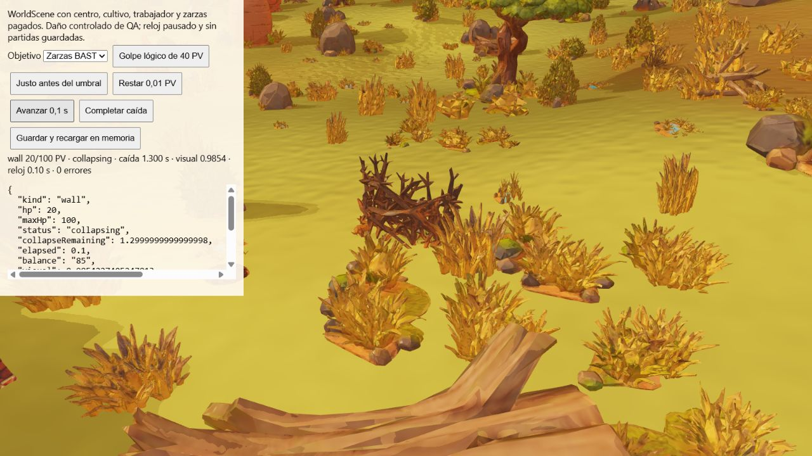
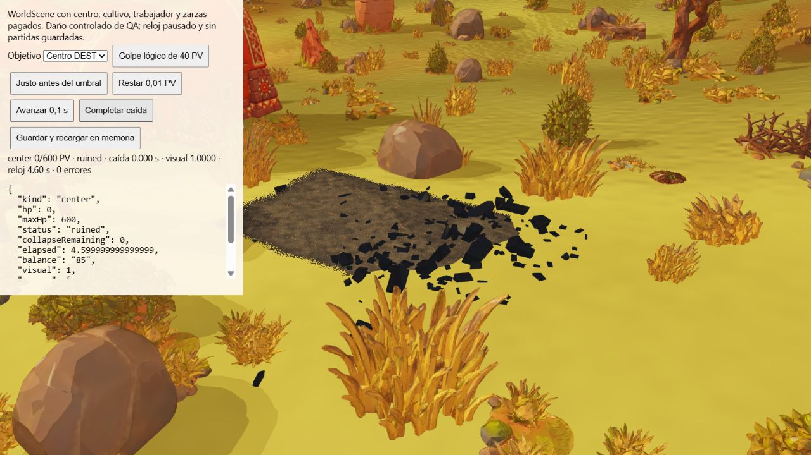

# Aceptación de puertas, golpes y umbrales

Implementación/pruebas `b97662a`. Se cotejan QA-072–075 contra los valores del
Plan Maestro y los contratos de BAST/DEST, sin modificar el plan de referencia.
[55 pruebas dirigidas](qa/defense-collapse/directed.txt) pasan: 12 casos nuevos
más geometría/morph nativos de murallas, cerramientos, cuatro clips por especie,
VFX de impacto y cinco arquitecturas DEST.

## Puertas pagadas: QA-072

Los cinco materiales cierran el mismo recinto mediante previewWallChain y
buildWallChain de producción, con Navigation real sobre terreno plano sin props.
Preview no muta estado. Cada compra crea exactamente una puerta automática;
misma posición/ID en dos estados equivalentes, salud 60% y mismo coste unitario.
La compra se cobra una vez por todos los módulos, sin suplemento por puerta.
Repetir el ID y guardar/cargar no añade piezas ni pagos. El test coteja valores
canónicos explícitos 10/20/35/55/80 y 100/200/300/400/500, en lugar de utilizar
la tabla de implementación como resultado esperado. Se concede financiación
controlada de QA para cubrir todos los materiales. No se presenta como cosecha real.
La geometría, puertas regionales y escalas nativas se cotejan también con la
fuente original en walls-native y wall-layout. No se acredita aquí la compra
mediante ratón en cada bioma ni sustituye QA-085 de colocación en terreno inválido.

## Golpes y colapso: QA-073/074

Las pruebas entran en la fase comprometida de ataque y dejan que Game.tick
termine el clip de combo; no llaman hitStructure para producir esos golpes.
Ambos combos alternan, no hay daño a medio clip, la pausa no adelanta el impacto,
y guardar/cargar mantiene el ataque. Cada final produce un StructureHit y un
AnimalLogicalHit, consume exactamente un cupo y aplica el daño canónico.

Las zarzas quedan en 60 PV tras un golpe de facóquero y en 20 PV tras dos;
empiezan la caída en el segundo, no exigen un tercero. Ruina tras 1,4 segundos
simulados, con un solo evento y estado persistente. Para cada cultura, un centro
intacto de 600 PV empieza a colapsar tras 12/10/7/6/4 golpes de facóquero, hiena,
búfalo, león y rinoceronte. Se conservan cupos legales individuales; se incorporan
más animales cuando se agotan, sin inventar un facóquero de 12 golpes. No se repara.
A los centros se les proporciona un saldo de recuperación de 800 para que el
Game Over por falta de fondos no congele el reloj antes de comprobar los 3,2 s.
La regla de derrota queda intacta. No se prueba aquí llegada/selección de objetivos,
composición sorteada ni el contacto físico del animal: son otros casos de IA.

## Fronteras distintas: QA-075

BAST permanece intacto justo por encima de 20% de vida y colapsa en 20% inclusive,
con 1,4 s. DEST permanece intacto en 126,01/600 PV; perder 0,01 más deja 126 PV,
79% de daño inclusive y 3,2 s. Golpear un estado ya colapsando no repite ni altera
su transición irreversible. No se unifican los dos porcentajes.

En el navegador, WorldScene de producción usa terreno, props y modelos originales,
con centro/cultivo/trabajador/zarzas comprados, saldo 85 y reloj de QA pausado.
Daño controlado mediante hitStructure; esta prueba visual no se atribuye a una
incursión sorteada. [Primer golpe](qa/defense-collapse/bramble-hit-1.json),
[segundo](qa/defense-collapse/bramble-hit-2.json),
[caída](qa/defense-collapse/bramble-falling.json),
[ruina a 1,4 s](qa/defense-collapse/bramble-ruined.json).
[DEST antes del umbral](qa/defense-collapse/center-before-threshold.json),
[en el umbral](qa/defense-collapse/center-threshold.json),
[caída](qa/defense-collapse/center-falling.json),
[cenizas tras otros 3,2 s](qa/defense-collapse/center-ruined.json). Sin errores
registrados en estas acciones. Visual representa vida restante para BAST y daño
normalizado para DEST, por lo que sus extremos finales son 0 y 1 respectivamente.

El guardado visual de esta fixture deserializa en memoria conservando WorldScene;
no acredita recreación completa del renderer durante una caída ni streaming.
QA-086/148 siguen pendientes. En especial hay que cotejar la envolvente visual
inicial de NativeWall con la de una caída restaurada en una escena nueva.
El CI exacto de b97662a continúa pendiente al publicar este informe.
