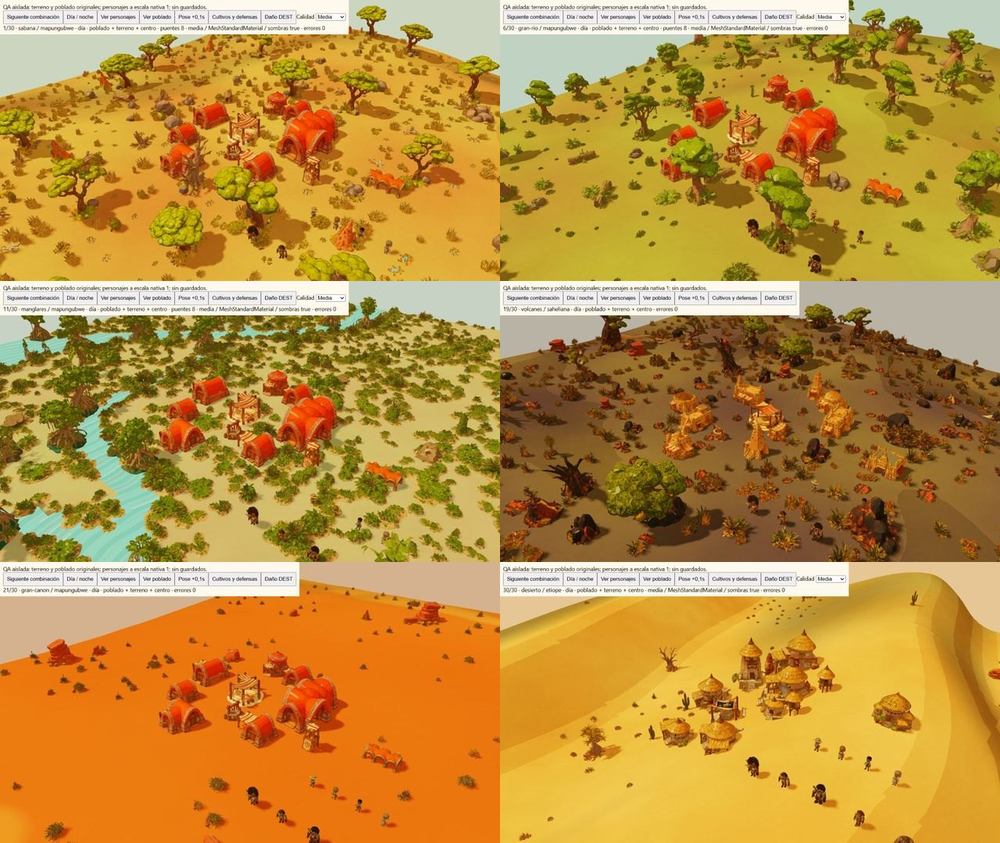

# African Toon V4.1.4 — adaptación y QA

Fecha: 2 de octubre de 2026. Rama `codex/african-toon-shader`; base integrada `b157835`. No cambia reglas de Game, geometrías originales ni escalas de los personajes.

## Fuente y adaptación

El fragment original se conserva byte por byte en `content/shaders/1-African_Toon_Shader_V4_1_4.frag.glsl`: 21.446 bytes, SHA-256 `2a9807568bf3c7fa4d55538a5b96b058e64a22f01b5fcd7044886e8a50053a93`. `provenance.json` registra esa procedencia. Las funciones `africanToon4`, cuatro bandas, relleno, tinta, pigmento, ruido, curva filmic y agua/lava pintadas se extraen literalmente (normalizando únicamente CRLF a LF para los strings JS).

La adaptación encadena `onBeforeCompile` de Three: conserva texturas, normal maps, alpha test, skinning, instancias, crecimiento, puentes de cultivo y sus materiales de profundidad. Recibe normales/posición mundiales, visibilidad de sombras de Three y reflejo indirecto disponible; usa una sola curva de tono. Los samplers de entorno día/noche y mapa de contacto del fragment no venían acompañados de sus texturas: no se inventan esos recursos, y no se afirma equivalencia píxel a píxel con el renderer WebGL original. DEST conserva su shader de daño, agujeros, normales de reparación, colapso y emisión; cambia su acabado final, con pigmento en coordenadas mundiales reales.

El terreno muy bajo mantiene `MeshBasicMaterial`, sin luces PBR ni mapas de sombra: recibe las bandas artísticas auténticas, tinta y pigmento con normales interpoladas. Las superficies transparentes, VFX, humo, manos/overlays Basic y preview fantasma mantienen sus materiales. El agua/lava usa las funciones originales pintadas con tiempo simulado; conserva su iluminación de Three y la emisión de lava. El menú vive en su propio iframe/renderer y no importa esta adaptación.

## Evidencia visual

Fixture de desarrollo: `tests/browser/african-toon.html?case=1`, con 30 casos declarados, cambio día/noche, vista de personajes, materiales, fase de carrera, daño DEST y calidad inicial. No utiliza guardados; las filas de actores, plantas y defensas son una fixture visual explícita, no una partida legal certificada. Renderiza al pulsar controles, para evitar un RAF costoso mientras se inspecciona.

Se inspeccionaron las 30 combinaciones, semilla 712 y calidad media: Sabana, Gran Río, Manglares, Volcanes, Gran Cañón y Desierto; cada uno con Mapungubwe, Suajili, Musgum, Saheliana y Etíope. Capturas individuales locales `test-results/african-toon/01-day.jpg` a `30-day.jpg`, más seis láminas de cinco culturas. Las capturas 01–18 preceden al último detalle de suelo (ruido/arena/estratos); 19–30 cubren el acabado Standard final. Se revalidaron después Sabana, Gran Río y Manglares, y se conservan vistas finales de los seis biomas. El cambio posterior de normales afectó únicamente al adaptador Basic; el cambio de clave de programa evita mezclar variantes, sin cambiar su apariencia.

- Cuatro perfiles y cinco bestias: presencia, texturas, escala nativa 1, día/noche; poses Run originales de los cuatro trabajadores avanzadas por pasos de 0,1 s. No se acredita aquí el ciclo completo de todos sus clips.
- Ocho cultivos: etapas maduras originales y ocho puentes activos de morph (contador visible `puentes 8`), día/noche; cinco muros y cinco puertas abiertas a 0,4, con geometría original. No se acredita aquí todo el ciclo agrícola ni todas las etapas de daño de cada defensa.
- DEST Etíope: golpe de 250 PV, corte/agujero nativo visible y sombra en vista cercana. Las pruebas de destrucción existentes acreditan la lógica y kernel, pero esta captura no certifica todo el colapso/VFX de cinco centros.
- Muy baja: carga inicial real con `MeshBasicMaterial`, sombras desactivadas, día/noche; alta: carga inicial `MeshStandardMaterial`, sombras activadas. La consola consultada no registra errores; los estados de las vistas finales muestran `errores 0`.
- Volcanes nocturno conserva lava emisiva. El diorama original del menú se revisó cargado, separado, sin bandas de este shader y sin errores de consola.

No se midieron FPS ni memoria en móviles; no se certifican todas las semillas, 30 combinaciones nocturnas, clima, los 18 VFX en vivo ni una campaña de cien noches. Durante el QA dos pestañas propias se atascaron al reutilizar escenarios pesados; se recuperó en una pestaña nueva y la fixture pasó a render explícito. No se cambiaron partidas ni se reinició el navegador del usuario.

## Comprobaciones

- Regresión integrada: **481/481** aprobadas, ninguna omitida, 338,74 s (`tests-african-toon-integrated.txt`), antes del adaptador Basic final.
- Pruebas dirigidas finales: **4/4** aprobadas; procedencia exacta, composición con deformaciones/profundidad, claves separadas de terreno/objeto, transparencias/agua nativas y Basic sin dependencias PBR/sombra (`toon-directed-final.txt`).
- Build final aprobado; conserva advertencia del tamaño del módulo principal.
- `verify:assets`: 23 fuentes, 484 recursos, 126 SFX exactos y 48 acciones originales de trabajadores.
- `verify:plan`: 123.048 aserciones.
- `test:web-package`: 546 archivos, 789 enlaces relativos, 20 GLB de runtime, sin duplicados originales. No requiere rutas del equipo ni CDN para esta adaptación.

Las láminas y capturas seleccionadas se conservan en `test-results/african-toon/`. Los informes completos quedan en el mismo workspace junto a los resultados anteriores. Estas cifras y capturas describen su alcance; no sustituyen los requisitos pendientes del Plan Maestro.

## Capturas revisables

Matriz de cinco culturas por bioma: [Sabana](../test-results/african-toon/matrix-1.jpg), [Gran Río](../test-results/african-toon/matrix-6.jpg), [Manglares](../test-results/african-toon/matrix-11.jpg), [Volcanes](../test-results/african-toon/matrix-16.jpg), [Gran Cañón](../test-results/african-toon/matrix-21.jpg), [Desierto](../test-results/african-toon/matrix-26.jpg).

Actores en [día](../test-results/african-toon/actors-run-day-final.jpg) y [noche](../test-results/african-toon/actors-run-night-final.jpg), cultivos/defensas en [día](../test-results/african-toon/crops-walls-morph-day.jpg) y [noche](../test-results/african-toon/crops-walls-morph-night.jpg), [daño DEST](../test-results/african-toon/dest-damage-final.jpg), [lava nocturna](../test-results/african-toon/20-night.jpg), calidad muy baja en [día](../test-results/african-toon/very-low-day-final.jpg) y [noche](../test-results/african-toon/very-low-night-final.jpg), [alta](../test-results/african-toon/high-day-final.jpg), [menú excluido](../test-results/african-toon/menu-excluded-final.jpg).
