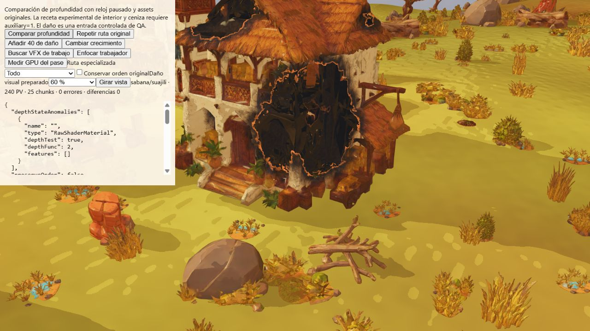

# Interior y ceniza: profundidad experimental, desactivada en partida

Implementación `bc6811b`, sobre `0a499fc`. La prioridad 7 sigue abierta para
estas superficies. La ruta requiere `BuildingDestructionPass.auxiliaryDepth === true`
al crear la casa; la fixture la habilita únicamente mediante `auxiliary=1` en la
URL. El juego conserva su receta original. No se cambian color, caras, sombras
ni el diorama. No se acredita un ahorro GPU o de FPS de esta ampliación.

La receta comparte vertex shader y uniforms vivos, conserva `LessDepth` del
interior y reutiliza literalmente los descartes originales: máscara de apertura,
profundidad intacta de precisión alta, margen de dos pasos del buffer de profundidad,
desaparición por semilla, agujeros y borde de ceniza. Sus materiales privados
se liberan al retirar la casa. Se evita iluminación en la pasada experimental.

## Evidencia y diferencias sin resolver

Semilla 712, media, 1600×900, reloj simulado pausado y assets originales. Daños
visuales preparados 0/20/60/85/98/100 %; 85/98 usan deformación de colapso y 100
ruina. Son entradas de QA, no ataques simulados. Se comparan seis estados en la
vista inicial y cinco dañados tras cada uno de tres giros de 90°.

- [84 comparaciones](qa/auxiliary-depth/comparisons.json), 21 por cultura:
  Suajili/Sabana, Mapungubwe/Manglares, Saheliana/Desierto y Musgum/Gran río;
  cero diferencias de profundidad.
- [90 comparaciones iniciales](qa/auxiliary-depth/initial-comparisons.json)
  incluyen seis estados Etíope/Volcanes. Su ruina presenta dos píxeles distintos,
  diferencia máxima normalizada 0,000004291534423828125.
- [Aislar solo la receta auxiliar](qa/auxiliary-depth/etiope-ruin-mismatch.json)
  reproduce esos dos píxeles. Conservar el orden original los elimina en ese
  ensayo, pero no cierra la equivalencia en otras vistas.
- Un ensayo posterior del orden del renderer presenta
  [seis píxeles distintos con daño 60 % y cámara girada](qa/auxiliary-depth/etiope-second-mismatch.json).
  [Original contra original](qa/auxiliary-depth/etiope-second-repeat.json) da cero;
  [receta auxiliar aislada y orden conservado](qa/auxiliary-depth/etiope-second-auxiliary.json)
  da cero en esa vista. Otros giros presentan nuevas diferencias. El cambio de
  orden ensayado no se incorpora al renderer de producción.

Estos ensayos preceden a la salvaguarda final. Las capturas por cultura pertenecen
al experimento inicial. No se atribuye una causa única ni se presenta la prueba
de orden como solución definitiva. Pendiente aislar las diferencias combinadas,
resolverlas, repetir las vistas finales y medir GPU antes de activar la receta.

## Salvaguarda final

[47 pruebas dirigidas](qa/auxiliary-depth/directed.txt), cero fallos/omisiones,
9.740,4218 ms: edificios de las cinco culturas, destrucción, profundidad, sombras
y Toon. Se comprueba que una casa creada sin la opción carece de la ruta auxiliar;
en modo QA se validan uniforms, recortes, restauración ante fallo y liberación.

[Build y paquete](qa/auxiliary-depth/build.txt) aprobados: 554 archivos,
379693431 bytes, 794 enlaces relativos y 20 GLB de ejecución. Persiste el aviso
del bundle mayor de 500 kB. [Seis comparaciones finales de la ruta normal](qa/auxiliary-depth/normal-final.json),
Suajili/Sabana, dan cero diferencias y errores en todos los daños preparados.
La [CI de bc6811b](https://github.com/dossijeo/wild-guardians-africa/actions/runs/37121755615)
se inició; su resultado no estaba disponible al registrar esta evidencia.

