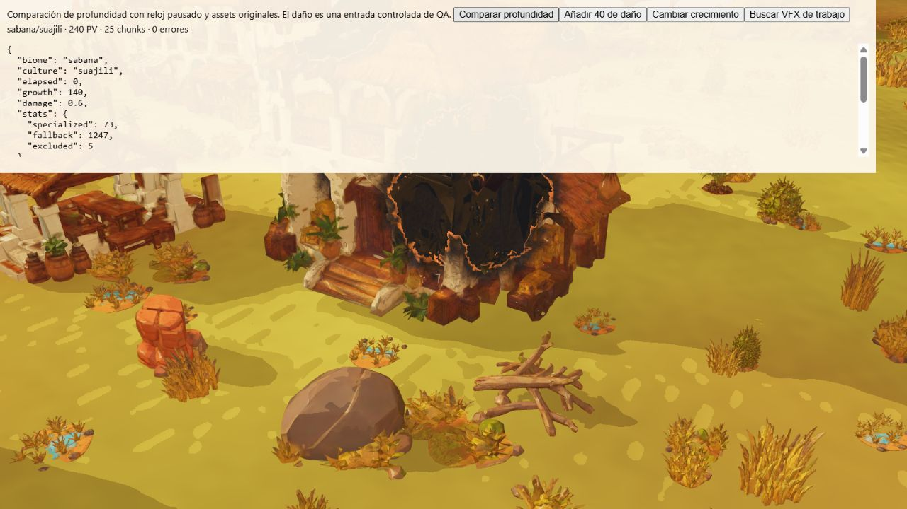

# Profundidad VFX — primera ruta especializada

Implementación `8d245c3`. `captureDepth` selecciona shaders de profundidad
ya escritos para cultivos (crecimiento y puentes de morph), exterior DEST
de centros y sólidos VFX. Conserva sus uniforms y callbacks vivos, incluidos
viento, deformación, cámara y campo de agujeros. No cambia el diorama del menú.

La sustitución exige una declaración explícita de compatibilidad. Conserva
la receta completa para materiales desconocidos, interiores y ceniza DEST,
skinning sin una ruta acreditada, grupos de materiales, clipping, alpha hash,
wireframe, desplazamiento o rasterización incompatibles. No sustituye todo el
mundo por un material genérico. Transparencias y materiales que no escriben
profundidad siguen excluidos como en la ruta anterior. Materiales, visibilidad,
renderer y target se restauran también si la captura lanza un error.

## Evidencia

[32 pruebas dirigidas](qa/depth-capture/directed.txt): conservación de originales
y uniforms ante fallo, exclusión de transparencia, fallback de recetas no
comprobadas, override del mundo, crecimiento/subidas de cultivos, cinco centros
con destrucción y VFX. La [suite de 751 pruebas](qa/depth-capture/full-tests.txt)
iniciada durante esta implementación pasa en 615402.92 ms. Las salvaguardas
finales de alpha hash, wireframe, desplazamiento y material invisible se
añadieron después de iniciar esa suite y se validaron con las 32 pruebas
dirigidas finales. El CI del commit final continúa pendiente; no se presenta
la suite anterior como ejecución exacta de ese commit.

Compilación final y paquete web aprobados: 554 archivos, 379680097 bytes,
794 enlaces relativos y 20 GLB de ejecución optimizados.

La [fixture](../tests/browser/depth-capture.html) carga el renderer y assets
originales, terreno de semilla 712 y centro, mijo y trabajador pagados. El daño
y los cambios directos de crecimiento son entradas controladas de QA. Solicita
captura incluso sin efectos para poder comparar. Con el reloj pausado captura
la ruta completa y la especializada consecutivamente, empaqueta la textura
real de profundidad a RGBA y compara todos sus bytes. Rechaza lecturas uniformes.

En 1600 × 900, 1440000 píxeles, cero diferencias en:

- Sabana/Suajili: [intacto](qa/depth-capture/intact.json),
  [crecimiento 52% y daño inicial](qa/depth-capture/growing-damaged.json),
  [maduro y daño 60%](qa/depth-capture/mature-deep-damage.json).
- Casas originales con daño 60%: [Mapungubwe](qa/depth-capture/mapungubwe-damaged.json),
  [Sahel](qa/depth-capture/saheliana-damaged.json),
  [Musgum](qa/depth-capture/musgum-damaged.json),
  [Etíope](qa/depth-capture/etiope-damaged.json).
- [Excavación con 19 sólidos](qa/depth-capture/working-vfx.json), generada por
  la tarea del trabajador real. Las rutas de sprites conservan su profundidad
  consultada y siguen excluidas de escribir en este pase.
- [Manglares/Mapungubwe con daño 60%](qa/depth-capture/mangrove-damaged.json),
  agua y vegetación originales.

Los contadores `specialized`/`fallback` cuentan selecciones de material,
incluidos lotes vacíos; no son llamadas dibujadas ni triángulos ahorrados.
La comparación verifica equivalencia en estas vistas y estados, no todas las
poses, culturas por bioma, ocho especies vegetales y fases de colapso.

## Trabajo que continúa

La mayor parte de props y terreno sigue usando su shader completo durante la
captura. Falta acreditar rutas baratas para esas categorías, clipping del
horizonte, interiores/ceniza y personajes con animación. También falta medir
tiempo GPU del pase en escenas con efectos y cultivos abundantes. Este cambio
evita shaders de color en las rutas indicadas; no acredita un porcentaje de
mejora ni explica FPS de una vista sin efectos.
