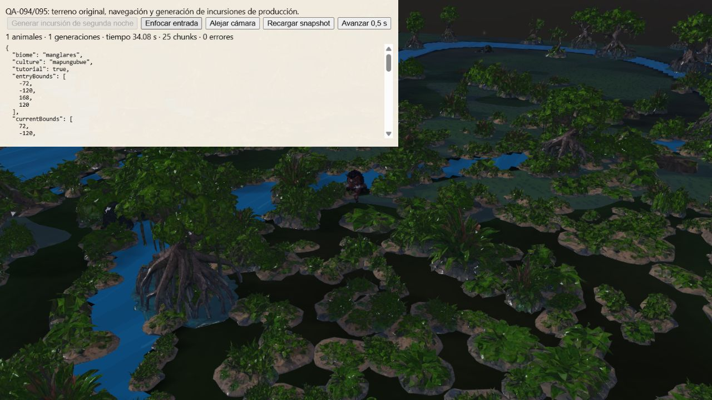
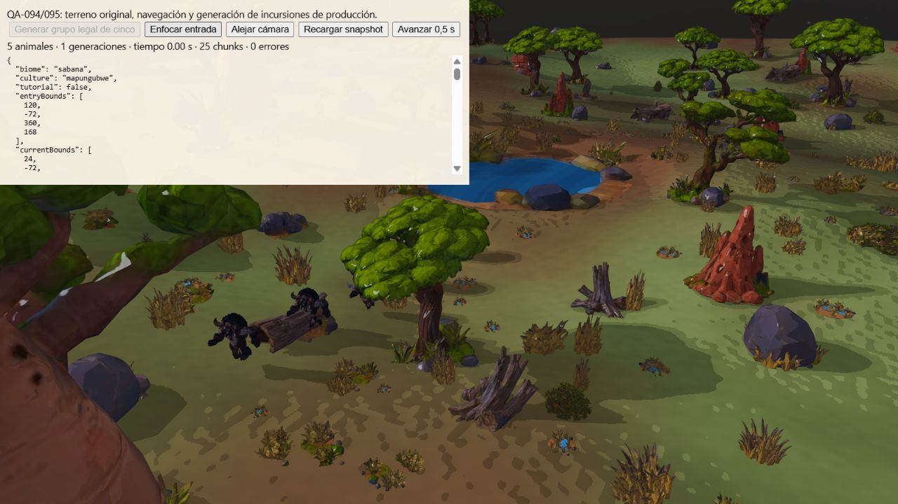

# Incursiones garantizadas y retirada física

Implementación `86b3d2b`, continuación de [QA-094/095](qa-raid-border.md).
El CI de `610edf6` falló en las cinco campañas de Manglares: 726 de 731
pruebas pasaron. El generador exigía una ruta al centro antes de crear el
animal, por lo que omitía la incursión garantizada de la segunda noche.

En el terreno original de semilla 712, el centro inicial de Mapungubwe está
en una componente de tierra sin conexión al perímetro activo. Muestrear más
entradas no crea una conexión. El apartado 13.7 del Plan Maestro permite
retirarse con golpes disponibles cuando no hay objetivos libres válidos.

El generador exige ahora cuerpos completos, separación, suelo transitable
y un corredor de salida de 3 m en el mismo borde. Busca todo el lado antes
de probar el siguiente. La selección de objetivos sigue usando navegación
real: no atraviesa agua ni ignora colisiones. La búsqueda de aproximación
parte del punto de servicio y devuelve la ruta invertida; esto permite
descartar una isla cerrada explorando su componente finita. No se atribuye
a este cambio una mejora de FPS.

Cada animal guarda una salida propia. Los guardados anteriores siguen usando
su posición original de aparición; una salida nueva no finita se rechaza.
La retirada implica desplazamiento real, sin borrar al animal en su punto
de aparición. Radios épicos, costes, golpes, terreno y fondos iniciales
conservan sus datos originales.

## Pruebas y alcance

Las [82 pruebas dirigidas](qa/raid-safe-exit/directed.txt) pasan, incluidas
reparaciones, reloj, trabajadores, cajas, límites de borde y planificación.
Las [nueve pruebas adicionales](qa/raid-safe-exit/safe-exit-tests.txt) pasan:
segunda noche con navegación original de Manglares en las cinco culturas,
guardado activo, desplazamiento sin colisiones, golpes conservados,
retirada completada y centro intacto; búsqueda del extremo remoto del borde;
rechazo de un corredor bloqueado; ruta invertida con un desvío real;
compatibilidad de guardados anteriores y validación de salidas.

El helper de campaña deja de presuponer que un centro en una isla debe recibir
daño. Sigue exigiendo una incursión, su final, guardado durante el ataque,
100 noches y victoria sin derrota. Si hay aproximación, exige daño real;
si no, exige vida intacta y ningún golpe remoto. Los pasos paran en los
instantes de planificación y aparición para poder guardar incluso una
incursión corta. La [suite completa](qa/raid-safe-exit/full-tests.txt) pasa:
748/748, cero fallos, cancelaciones u omisiones, 501565.78 ms. Incluye las 30
campañas mínimas de seis biomas por cinco culturas y las dos fincas activas
de 100 noches. El [CI del commit de implementación](qa/raid-safe-exit/ci.json)
terminó correctamente: validaciones, 748 pruebas, compilación, paquete web,
ZIP itch y artefactos publicados. También terminó correctamente el CI del
commit de documentación `26e7a0e`.

Verificaciones de assets, assets web y plan aprobadas. Compilación y paquete
web aprobados: 554 archivos, 379679088 bytes, 794 enlaces relativos y 20 GLB
de ejecución. El validador de GLB conserva los avisos de conformidad originales
registrados por el pipeline; no se afirma que cada asset tenga cero avisos.

## Navegador

Fixture con renderer, modelos y navegación de producción, calidad media,
semilla 712 y centro comprado con los fondos iniciales. Manglares/Mapungubwe
prepara explícitamente el día 2 a las 299 s; el reloj real planifica y genera
la incursión. No es una prueba visual de toda la campaña.

[Aparición](qa/raid-safe-exit/mangrove-spawn.json): un facóquero, radio 1.1,
dos golpes, X 163.65, salida X 166.65. [Tras 0.5 s](qa/raid-safe-exit/mangrove-retreat.json)
está en X 165.17 retirándose; [tras 1 s](qa/raid-safe-exit/mangrove-ended.json)
la incursión termina, una generación y un final, centro con 600 de vida.
[Recarga](qa/raid-safe-exit/mangrove-restored.json) conserva animal y salida.
El rig original se carga y no se observan errores de página.

Sabana/Mapungubwe prepara la composición legal de noche 21: tres facóqueros
y dos búfalos, presupuesto 13. [Aparecen juntos](qa/raid-safe-exit/savanna-spawn.json)
en X 124.35, salida X 121.35, dentro de `[120,-72,360,168]`, rigs cargados,
golpes `[2,2,2,6,6]`. La [comparación cerca/lejos](qa/raid-safe-exit/camera-comparison.json)
acredita registros idénticos tras 0.5 s desde el mismo snapshot, incluso con
la cámara a más de 1 km. Cuatro animales se retiran al estar reservado el
único centro; eso sucede igual en ambas ramas. No es un descarte por cámara.

## Planificación — QA-087 a QA-093

Las ocho pruebas de `tests/acceptance-raid-planning.test.js` usan una tabla
independiente y un enumerador cartesiano de conteos por especie:

- QA-087: diez fronteras exactas de atracción; plantas vivas con su valor
  base, sin influencia de saldo, cajas, progreso ni bonus de cosecha.
- QA-088: noche 1 tranquila y noche 2 con un facóquero, reloj y guardado;
  además las cinco pruebas nativas de Manglares anteriores.
- QA-089: 1000 decisiones con oráculo independiente de RNG, consumo de
  sorteos exacto y resultados consecutivos iguales, sin compensación.
  Es una comprobación del planificador, no 1000 combates simulados.
- QA-090: presupuesto 3 admite exactamente una hiena o tres facóqueros.
- QA-091: conjunto completo de composiciones en 16 contextos nocturnos y
  cuatro diurnos; coste 75–100%, máximo cinco y topes por especie.
- QA-092: 120 permutaciones y entradas duplicadas no duplican composiciones.
- QA-093: león y rinoceronte asequibles siguen excluidos si están bloqueados;
  desbloquearlos sí permite composiciones que los incluyen.

La auditoría sigue siendo incremental. Estas evidencias no acreditan todos
los casos del Plan Maestro ni rendimiento en móvil.
