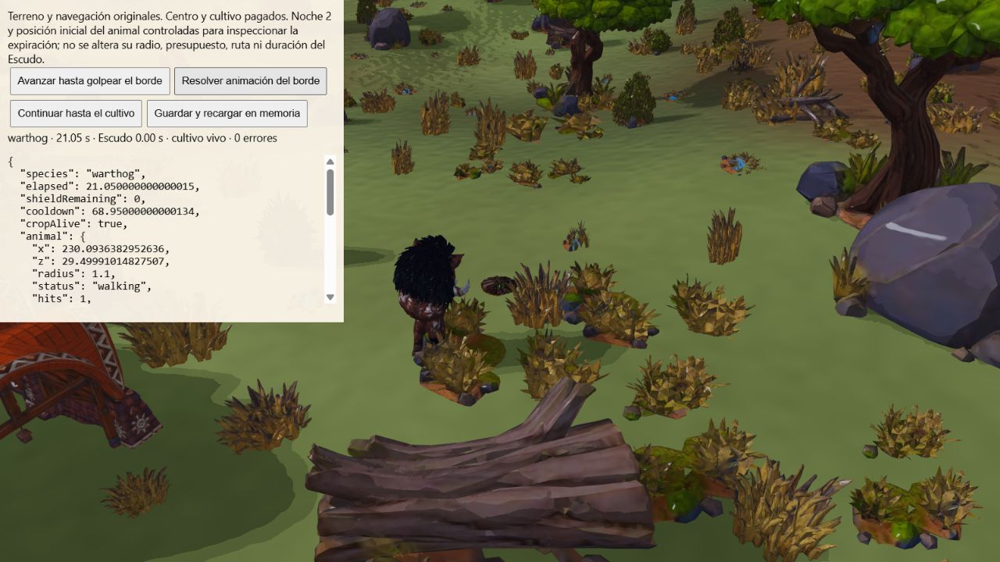

# Expiración física del Escudo durante un ataque

Corrección `2586978`, QA-118. La animación empezaba en el borde del Escudo,
pero, si este expiraba antes de su final, el golpe se aplicaba al cultivo
protegido desde esa posición distante. La [regresión anterior](qa/shield-expiry/regression-before.txt)
reproduce el daño remoto con las cinco especies.

El ataque conserva el identificador del borde al que se dirigía. Al completar
su animación, si ese borde ya no existe, termina como `AnimalLogicalMiss` con
motivo `shield-expired`. Consume un golpe del presupuesto, como un ataque cuyo
objetivo desapareció; no genera daño ni un impacto lógico/VFX sobre el cultivo.
El animal conserva su objetivo y reserva. En el siguiente avance recalcula
el acceso directo y tiene que llegar físicamente antes de iniciar otro ataque.
No se prolonga el Escudo ni se interrumpe la animación nativa ya comprometida.

## Comprobaciones

[85 pruebas dirigidas](qa/shield-expiry/directed.txt), cero fallos/omisiones:
incursiones, navegación, ataques/VFX, colapsos, permisos, reloj y guardado.
Cinco especies × cinco culturas usan Navigation de producción sobre terreno
plano sin props, con centro/semilla pagados, radios y presupuestos originales.
La posición inicial y noche son controladas explícitamente. El animal recorre
la ruta, comienza su clip justo antes de expirar el Escudo y se pausa/recarga.
Al terminar: cultivo vivo, mismo punto del borde y un solo golpe fallido.
Después avanza por segmentos legales, alcanza el cultivo y lo destruye con
un nuevo ataque cercano, una sola vez.

Otro escenario por especie usa semilla 123, que sortea naturalmente suficientes
golpes: confirma al menos un bloqueo sobre la cúpula activa, consume presupuesto
y continúa físicamente tras expirar. No se aumenta artificialmente el cupo.
Las cinco especies comprueban también colocar el Escudo justo dentro/fuera de
su radio corporal: rechazo sin mutaciones ni teletransporte, aceptación sin
moverlas y navegación que bloquea cruzar la barrera para animales pero permite
el paso de trabajadores. Estas pruebas no representan todas las poses y rutas
en los seis biomas originales; QA-119 sigue parcial.

[Build y paquete](qa/shield-expiry/build.txt): 554 archivos, 379689465 bytes,
794 enlaces relativos, 20 GLB de ejecución sin duplicados originales.

## Navegador con terreno original

Sabana/Mapungubwe, semilla 712, facóquero nativo con radio 1,1 y presupuesto
natural de dos golpes, centro y mijo pagados. La fixture controla noche y
posición inicial para situar la expiración durante el primer ataque. Busca un
corredor transitable en la navegación original; no altera terreno, props,
radios, velocidad, clip o duración de 20 s. No usa slots guardados del usuario.

- [Borde](qa/shield-expiry/edge.json), 19,50 s: Escudo restante 0,50 s;
  clip 1,541666705 s, distancia al cultivo 3,15 m, dos golpes disponibles.
- [Snapshot recargado](qa/shield-expiry/edge-restored.json): datos idénticos,
  conservando posición, clip, reloj, recarga y presupuesto. Recarga en memoria
  con la misma WorldScene; no se acredita recreación del renderer en este caso.
- [Animación resuelta](qa/shield-expiry/miss.json), 21,05 s: Escudo expirado,
  cultivo vivo, distancia 3,15 m, un golpe disponible; un `shield-expired`
  y ningún `AnimalLogicalHit` remoto.
- [Golpe cercano](qa/shield-expiry/crop-hit.json), 23,60 s: distancia 1,70 m,
  cultivo destruido, cero golpes disponibles, exactamente un impacto lógico.

La [consola](qa/shield-expiry/console.json) registra cero errores y un warning
de compilación ANGLE del shader de entorno, pendiente de revisar separadamente.
Pestaña y Vite de QA cerrados; el origen del usuario en 5173 queda intacto.
El CI del nuevo commit se encuentra en curso; no se atribuyen las 780 pruebas
del commit anterior a esta corrección.
