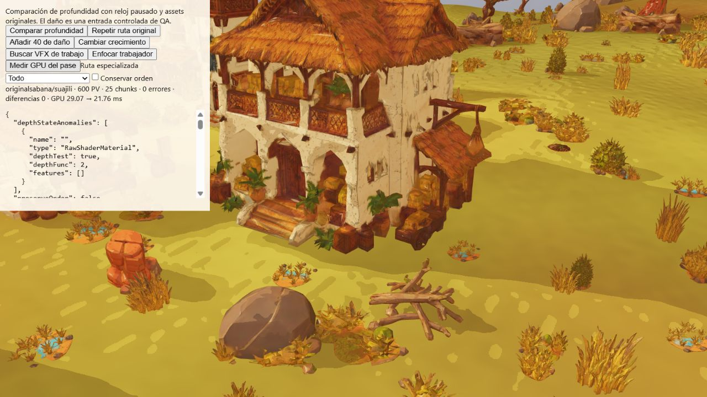

# Profundidad VFX — materiales nativos y salvaguarda de alpha

Implementación inicial `51451ed`, salvaguarda final `06cf866`. La captura añade
MeshDepthMaterial a superficies opacas de recetas conocidas: terreno, horizonte,
construcciones y actores Standard/Basic. Conserva transformaciones nativas,
instancing, skinning, morph y desplazamiento de Three r180; replica recortes de
chunk, dithering de obstrucción y el rectángulo semiabierto del horizonte.
Los uniforms y bounds se comparten con sus fuentes y siguen el origen flotante.
El diorama del menú conserva su renderer y materiales.

Un WeakMap acredita el callback real de cada receta. Una sustitución desconocida
invalida esa autoridad; clonar userData no la transmite. La caché por material
sigue propiedades y versión de la fuente, se sincroniza una vez por captura
cuando varias mallas la comparten y se libera al disponer la fuente. Las texturas
se comparten sin apropiarse de su vida útil. Los shaders de color se siguen
utilizando en la imagen principal.

## Diferencia detectada y salvaguarda

En Manglares/Mapungubwe la primera ampliación produjo 10–14 píxeles distintos
de 1.440.000, con diferencia máxima de profundidad normalizada 0,00003213.
[Datos iniciales](qa/standard-depth/mangrove-all.json). Repetir la ruta original
da cero diferencias; aislar materiales con y sin alpha test también da cero.
Conservar el orden original solo elimina parte de la diferencia: no se atribuye
su causa completa al orden ni se presenta como corregida cambiando el sort.

`06cf866` mantiene la receta original de superficies con alpha test que carecen
de un customDepthMaterial acreditado. Las rutas específicas ya verificadas de
cultivos, exterior DEST y sólidos VFX siguen disponibles. La comparación final
de [manglares](qa/standard-depth/mangrove-safe.json) da cero diferencias.
La ruta Standard con alpha permanece probada a nivel de shader y propiedades,
pero no se habilita automáticamente en partida hasta acreditar equivalencia
combinada. Interiores/ceniza Raw, callbacks desconocidos, grupos de materiales,
alpha hash, clipping o rasterización incompatible siguen usando la receta completa.

## Validación

El [CI exacto de 51451ed](qa/standard-depth/ci.json) pasa **756/756 pruebas**,
verificaciones de assets, plan y rutas web, compilación, ZIP y artefactos.
[Log completo](qa/standard-depth/ci-log.txt). La suite local de 756 pasó antes de
las últimas salvaguardas de esa ampliación; 62 pruebas dirigidas comprobaron esos
ajustes finales. Tras la salvaguarda `06cf866` pasan [45 pruebas dirigidas](qa/standard-depth/safe-directed.txt),
con un caso adicional que conserva alpha nativo y permite profundidad authored.
El [CI exacto de esa salvaguarda](qa/standard-depth/safe-ci.json) termina correctamente: **757/757 pruebas**, verificaciones, build, ZIP y artefactos. [Log](qa/standard-depth/safe-ci-log.txt).

[Compilación final y paquete](qa/standard-depth/safe-build.txt): 554 archivos,
379684668 bytes, 794 enlaces relativos y 20 GLB de ejecución, sin duplicados
originales. El shader principal y los assets no se simplifican para esta prueba.

La comparación lee todos los píxeles de la textura real de profundidad en
1600×900, con reloj pausado, semilla 712 y calidad media. Rechaza una textura
uniforme. Los datos de cada vista se conservan junto a este informe. Estas
vistas no equivalen a la matriz completa de 30 combinaciones, todos los ángulos,
poses, especies, daños, perfiles gráficos y dispositivos móviles.

| Vista final `06cf866`, semilla 712, media | Píxeles diferentes |
| --- | ---: |
| [Sabana / Suajili](qa/standard-depth/savanna-safe-gpu.json) | 0 |
| [Gran río / Musgum](qa/standard-depth/river-safe.json) | 0 |
| [Manglares / Mapungubwe](qa/standard-depth/mangrove-safe.json) | 0 |
| [Volcanes / Etíope](qa/standard-depth/volcano-safe.json) | 0 |
| [Gran cañón / Mapungubwe](qa/standard-depth/canyon-safe.json) | 0 |
| [Desierto / Saheliana](qa/standard-depth/desert-safe.json) | 0 |

Las cinco culturas aparecen al menos una vez; no se acredita cada cultura en
cada bioma. Las vistas finales usan scope=all y el orden de dibujo normal.

El [trabajador en acción](qa/standard-depth/working-worker.json) alcanza su tarea
real en 59,02 s simulados y coincide en profundidad al enfocar su cuerpo completo.
[Inspección del GLB original](qa/standard-depth/worker-skin.json): un skin, un nodo
con skin, atributos de articulaciones y 12 clips. No se sustituye por un proxy.
La lectura inicial corresponde a `51451ed`; la [pose final en 06cf866](qa/standard-depth/working-worker-safe.json) también coincide con cero diferencias. El cronómetro visible en las capturas pertenece a la escena inicial y no mide esa pose.

## Medición GPU

El temporizador EXT_disjoint_timer_query_webgl2 rodea únicamente captureDepth,
con ocho frames de calentamiento por ruta y 44 muestras resueltas por ruta.
No mide el frame completo ni la pasada de sombras/color. Sin queries perdidas,
disjoint, desbordamientos o pendientes en las mediciones completadas.

| Versión y escena Sabana/Suajili inicial | Ruta original media | Ruta especializada media |
| --- | ---: | ---: |
| Primera ampliación, primera ejecución | 27,44 ms | 11,60 ms |
| `51451ed`, repetición | 27,57 ms | 11,21 ms |
| `06cf866`, salvaguarda final | 29,07 ms | 21,76 ms |

[Primera medición](qa/standard-depth/savanna-gpu.json),
[repetición en 51451ed](qa/standard-depth/savanna-final-gpu.json).
La segunda supone 59,34 % menos tiempo en esta pasada, **no** 59,34 % más FPS.
Es una medición anterior a la salvaguarda de alpha; no se usa como cifra final
para `06cf866`. La [medición final](qa/standard-depth/savanna-safe-gpu.json) conserva
44 muestras por ruta sin pérdidas y da **25,14 % menos tiempo de captura**
(7,31 ms de diferencia entre medias) con cero diferencias de profundidad.
Las medianas son 28,34 y 21,84 ms. La ganancia final es menor porque las superficies
alpha conservan su shader. La captura se solicita cuando los VFX necesitan profundidad;
no explica ni garantiza acelerar una vista inicial sin efectos.

Los contadores specialized/fallback son selecciones de material e incluyen
lotes vacíos y objetos fuera de cámara; no son draw calls o triángulos ahorrados.

## Pendiente

Acreditar y optimizar alpha combinado, interiores/ceniza Raw y ampliar estados
de actores, daños y horizonte. Medir escenas con más efectos, cultivos y móvil.
La auditoría funcional del Plan Maestro continúa independiente de esta mejora.
