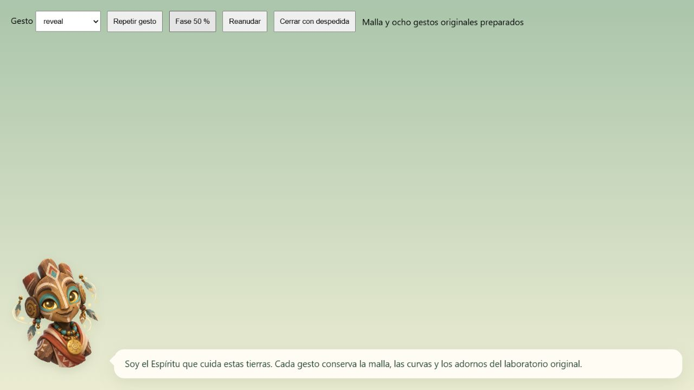
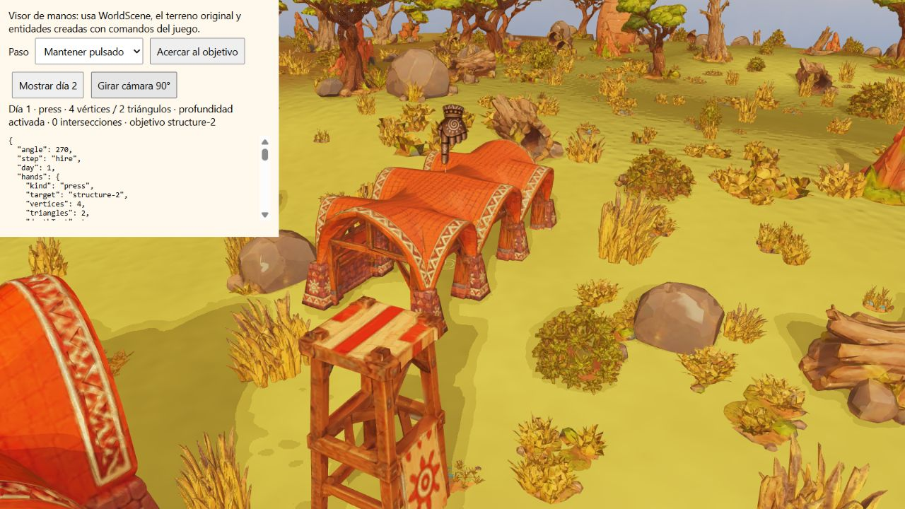
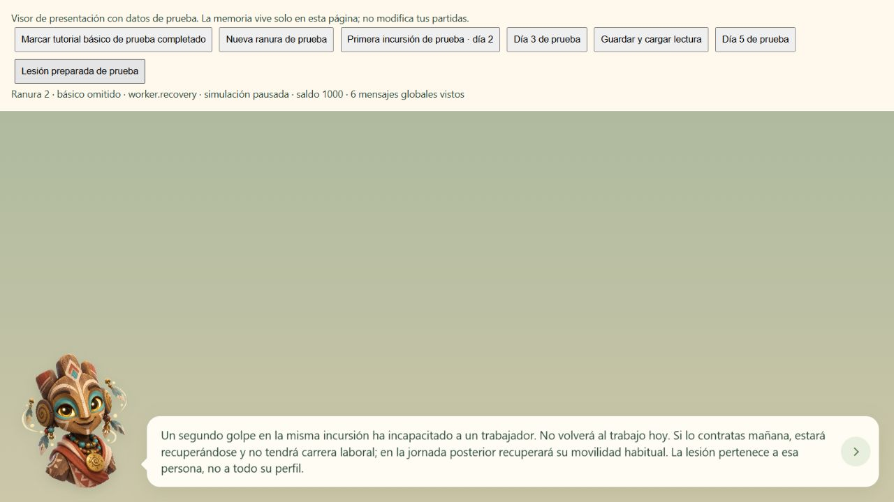
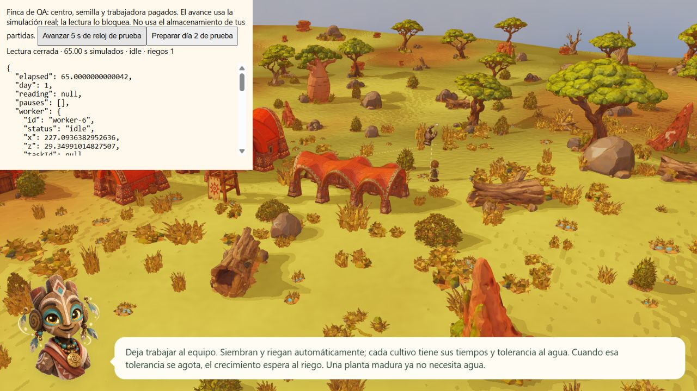

# Tutorial nativo: gestos, manos, memoria y reanudación

Base de gameplay `bc6811b`; controles de QA `b02c492` y encuadre final `b3e8232`.
Se utilizan NativeGuardian, GuardianLifecycle, NativeHands, TutorialController,
Game y WorldScene de producción. Las fixtures no acceden al almacenamiento de
las partidas del usuario. No se modifica gameplay para aprobar estos casos.

## QA-121: ocho gestos y sistemas separados

[Ocho capturas y metadatos](qa/tutorial-native/gestures.json) acreditan
`greeting`, `speak`, `acknowledge`, `curious`, `warning`, `reveal`, `idle` y
`farewell`, visibles en el renderer WebGL nativo de 404×404. La fixture prepara
la fase 50 % para inspeccionar cada pose; no pretende medir su duración natural.
Las pruebas comparan las curvas de los ocho gestos con V8 en 600 muestras,
verifican hashes de fuente/módulo y estabilidad de adornos.

[Cerrar mediante la UI](qa/tutorial-native/withdrawal.json) inicia `farewell`
y llega a `closed` sin avanzar el texto. GuardianLifecycle conserva los tiempos
originales de entrada/salida y sus estados separados de la lectura; sus pruebas
cubren entrada, reposo, retirada repetida, interrupción y movimiento reducido.
Las manos pertenecen a NativeHands/WorldScene, no al renderer del avatar.

## QA-122: plano completo junto a obstáculos y cámara girando

Sabana/Mapungubwe, semilla 712, centro y cultivo pagados, trabajador contratado.
[Doce vistas](qa/tutorial-native/hand-plane.json): mano abierta en la entrada del
poblado, señalar el centro y mantener pulsado sobre el centro; cuatro giros de
90° por gesto. Todas conservan 4 vértices, 2 triángulos, profundidad activada,
alpha visible, cero intersecciones y cero elevación residual requerida sobre
los triángulos del terreno. Los colliders incluyen dos obstáculos en la entrada
y seis alrededor del centro; no se elimina la casa para facilitar la prueba.

Las capturas incluyen mano y obstáculo completos. El encuadre de QA respeta
que la cámara nativa fija su objetivo al suelo +0,18; no altera la cámara de
partida. Las pruebas del protector acreditan también el obstáculo que cruza
el centro del quad aunque sus cuatro esquinas queden fuera de la huella.
Estas vistas no acreditan todos los biomas, culturas, daños o ángulos posibles.

## QA-123: mensaje posterior al día 1

En la misma finca de trabajo, el botón de QA prepara el día 2 sin simular una
noche. El controlador presenta `mechanic.defenses` mediante el Espíritu,
visible y modal; NativeHands retira su mesh y devuelve kind null.
[Estado y metadatos DOM](qa/tutorial-native/day2.json),
[captura](qa/tutorial-native/day2.png). Es una prueba de presentación conjunta
del día 2, no una prueba de la transición natural del amanecer.

## QA-124: omitir básico sin silenciar mensajes nuevos

[Secuencia de UI y textos](qa/tutorial-native/memory.json): la memoria preparada
de un tutorial básico completado habilita omitirlo en la ranura 2. Después
aparecen primera incursión, Escudo, defensas, Growth, Multiply y recuperación.
Guardar/cargar Growth sin reconocerlo mantiene lectura y pausa. En la ranura 3,
tras reconocerlos en la anterior, magia y recuperación conocidas no repiten la
lectura. El saldo continúa en 1000 en ambas ranuras.

La memoria de básico completado, días, incursión vacía y persona lesionada son
precondiciones explícitas de QA. No se presenta esta fixture como una incursión
real ni como prueba visual del daño. `tests/tutorial.test.js` complementa la
precondición con un tutorial completado por cosecha y entrega real pagada.
La lesión real está cubierta en [su auditoría independiente](qa-live-injury.md).

## QA-125: cerrar lectura libera trabajo real

[Secuencia integrada](qa/tutorial-native/worker-reading.json) con terreno,
navegación y entidades nativas. Los únicos cargos son centro, mijo y salario,
saldo 95. Introducción y `basic.work` bloquean Game.advanceReal: cinco segundos
de entrada de reloj no cambian elapsed 0 ni la posición de la trabajadora.
Continuar cierra la lectura y deja pauses vacío. La misma API de avance conduce
a llegada, desplazamiento hacia task-7, acción a los 60 segundos y primer riego
manual a los 65 segundos; crecimiento 2,76, saldo 95 y tres cargos, sin repetidos.

Los intervalos de cinco segundos son entradas controladas del reloj de prueba,
no cinco segundos de espera física. No se fuerzan posiciones, tareas, crecimiento
ni riego. WorldScene presenta el estado resultante y el avatar queda como
explicación no bloqueante. La prueba del dominio recorre además madurez, orden,
transporte, cobro de 104 monedas y reconocimiento del tutorial completo.

## Validación y alcance

[45 pruebas dirigidas](qa/tutorial-native/directed.txt), cero fallos/omisiones,
12032,3892 ms: guardian nativo, ciclo de vida, manos, terreno y tutorial.
[Consolas de las cuatro fixtures](qa/tutorial-native/console-errors.json):
sin errores de aplicación registrados. Una interacción lenta del avance inicial
se inspeccionó y terminó correctamente; se redujeron renders redundantes en
la fixture manteniendo todos los pasos de Game.advanceReal. No se modifica
ni se atribuye una mejora de rendimiento al renderer de producción.

La matriz general del Plan Maestro continúa abierta. Estas comprobaciones
acreditan QA-121–125; no la entrada real de todas las combinaciones, móvil,
audio, escalado ilimitado o las demás aceptaciones pendientes.
