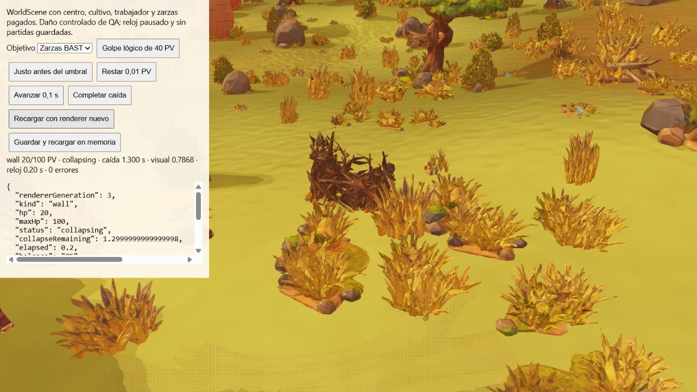

# Continuidad de daño y caída BAST al cargar

Corrección `9d7a907`, relativa a QA-148. La prueba nueva reproduce un salto real
antes del cambio: tras 0,24 s de daño, NativeWall tenía vida visual 0,65, pero
crearlo desde el snapshot producía 0,60. La interpolación y el origen de colapso
solo existían en el renderer. [Fallo anterior](qa/wall-reload/regression-before.txt).
La prueba anterior de cargar caída creaba ambos renderers ya a mitad de caída;
no comparaba una secuencia viva de impactos con una escena recreada.

## Cambio

El golpe lógico de una incursión registra wallPresentation con origen, destino
y hora simulada de la interpolación BAST de 480 ms. Al iniciar colapso conserva
además el origen visual exacto; mantiene los 1,4 s y el smoothstep nativo.
No altera PV, umbral, cupos, costes ni azar. NativeWall recibe el tiempo simulado
al crearse y actualizarse en WorldScene, y reconstruye la geometría a partir de
esos datos sin escribir al dominio. No depende de que el renderer anterior haya
procesado un frame entre impactos. La pausa mantiene el mismo tiempo y fase.

Los nuevos campos son opcionales dentro de saveVersion 1. Guardados anteriores
siguen cargando con el fallback previo de ratio de salud: no pueden recuperar
una interpolación que nunca almacenaron. Se rechazan campos no finitos, ratios
fuera de 0–1, timestamps futuros y un origen de caída incoherente con intacto.
Una reparación pagada elimina el origen viejo de daño/colapso; la prueba de
reparación física comprueba ese borrado y la conservación del cobro único.
La interpolación visual ascendente de reparación y su recreación inmediata
quedan pendientes de un cotejo equivalente; no se presentan como verificadas.

## Evidencia

[51 pruebas dirigidas](qa/wall-reload/directed.txt): cinco materiales × muro/puerta,
impacto normal, caída, pausa y ruina. Se serializa el estado vivo y se crea una
instancia NativeWall nueva: mismo valor visual, etapa, todos los vértices y
normales. El renderer no muta el snapshot. Se incluyen golpes de combos, puertas
pagadas, reparación física y validación de los nuevos campos/compatibilidad.
El [CI exacto de 9d7a907](qa/wall-reload/ci.json) pasa **773/773 pruebas**, verificaciones, compilación, ZIP y artefactos. [Log](qa/wall-reload/ci-log.txt). La suite completa local en Windows sigue en ejecución; su proceso permanece activo y no se reinicia.

[Build y paquete web](qa/wall-reload/build.txt) pasan: 554 archivos, 379685827 bytes,
794 enlaces relativos y 20 GLB de ejecución sin duplicados originales.

En el navegador se dispone WorldScene completo y se crea otro a partir del
snapshot, recargando assets, chunks, materiales y actores originales. Misma
cámara y simulación pausada; no se escribe en las partidas del usuario.

| Estado | Escena viva | Escena recreada |
| --- | --- | --- |
| Daño, 60 PV, tiempo 0,1 s | [Generación 1, visual 0,7984664351851851](qa/wall-reload/damage-live.json) | [Generación 2, mismo valor](qa/wall-reload/damage-restored.json) |
| Caída, 20 PV, 1,3 s pendientes | [Generación 2, visual 0,7868269827772377](qa/wall-reload/collapse-live.json) | [Generación 3, mismo valor](qa/wall-reload/collapse-restored.json) |
| Ruina a tiempo 1,5 s | Caída completada | [Generación 4, 0 PV y visual 0](qa/wall-reload/ruin-restored.json) |

Las lecturas conservan saldo 85, fase, etapa y reloj exactos, sin errores registrados.
Daño de entrada controlado de QA; no se atribuyen estas capturas a un animal
sorteado. El código de daño real de incursiones también entrega su tiempo simulado.

QA-148 permanece parcial: este informe acredita daño/colapso BAST con renderer
nuevo, no todos los efectos DEST, cooldowns, ángulos, apertura de puertas,
reparaciones ni streaming de chunks. QA-086 tampoco se marca cerrado por esta
recreación global: requiere su descarga/carga específica de chunks y colisiones.
