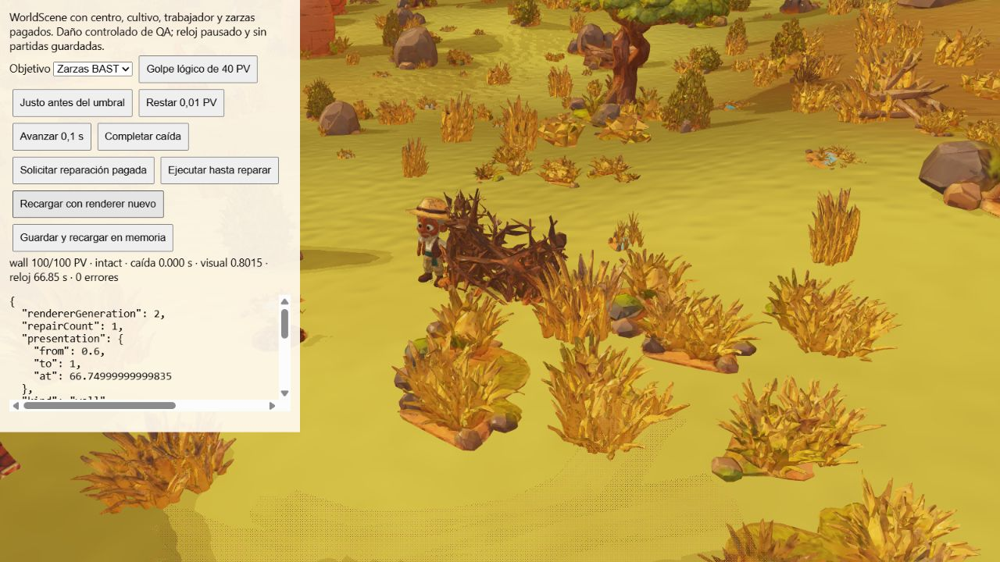

# Continuidad de reparación y reconstrucción BAST

Corrección `6450398`, ampliación de QA-148. Tras conservar la interpolación del
daño, la reparación eliminaba su estado y saltaba directamente al aspecto intacto.
El [regression test anterior](qa/wall-repair/regression-before.txt) exige conservar
la transición ascendente de 480 ms del lab BAST y reproduce ese fallo.

Al completar una reparación pagada en su punto de servicio, el dominio calcula
el aspecto visual actual, restaura la salud lógica y registra un nuevo origen,
destino 1 y hora simulada. Reemplaza el estado anterior y elimina el origen de
colapso. La presentación retoma esa transición desde el snapshot, con pausa y
recreación de renderer. No retrasa la restauración lógica ni cambia el cobro,
la duración del trabajo o la colisión de una defensa operativa.

## Pruebas

[52 pruebas dirigidas](qa/wall-repair/directed.txt) pasan, incluidas cinco defensas
× muro/puerta × reparación/reconstrucción desde ruina: 20 escenarios de tarea
física pagada con Navigation, contratación y movimiento de producción sobre
terreno de prueba plano y sin props. Financiación adicional explícita de QA de
200 monedas para cubrir todos los precios; no se presenta como campaña natural.
Se comprueba ausencia de cobro al solicitar, un solo pago al llegar y coste
canónico del 20% de daño o del 100% de reconstrucción. Se crea NativeWall desde
snapshot al inicio, a 0,1 s y al acabar la transición: idéntico valor, etapa y
vértices; ninguna mutación del snapshot por el renderer. También siguen pasando
las pruebas de golpes, puertas pagadas, caída, pausa, reparación fallida y replay.

[Compilación y paquete](qa/wall-repair/build.txt): 554 archivos, 379685902 bytes,
794 enlaces relativos, 20 GLB de ejecución y ningún original duplicado. El CI de
6450398 sigue en curso al redactar este informe. La suite local anterior pasa
[773/773 pruebas](qa/wall-reload/full-tests.txt), en 550162,228 ms; no se atribuye
ese recuento anterior a la nueva reparación.

## Navegador con terreno original

WorldScene conserva las zarzas, centro, cultivo y trabajador comprados. El daño
inicial de 40 PV es controlado de QA. Solicitar la reparación deja el saldo en
[85](qa/wall-repair/requested.json). Game.tick ejecuta la tarea y el recorrido
real del empleado; no se ejecuta un comando de reparación inmediata de un lab.
La fixture se detiene en el primer evento de pago.

[Inicio pagado](qa/wall-repair/paid-start.json): 100 PV lógicos, visual 0,6,
reloj 66,75 s, un RepairApplied y saldo 81: coste proporcional 4 monedas.
A 0,1 s de la restauración la [escena viva](qa/wall-repair/fade-live.json)
conserva visual 0,8015335648148059; la [escena recreada](qa/wall-repair/fade-restored.json) conserva exactamente el mismo estado, cámara, reloj y saldo.
[Final](qa/wall-repair/finished.json): visual 1, saldo 81 y un solo RepairApplied; no hay segundo pago. No se escribe en slots del usuario. Los datos
registrados corresponden a esta vista y escenario, no a todas las culturas/biomas.

QA-148 continúa parcial: reparación/daño/caída BAST tienen esta evidencia,
pero quedan los demás estados DEST, cooldowns, aperturas de puertas y streaming
específico. La escena anterior se dispone antes de crear el renderer nuevo.
