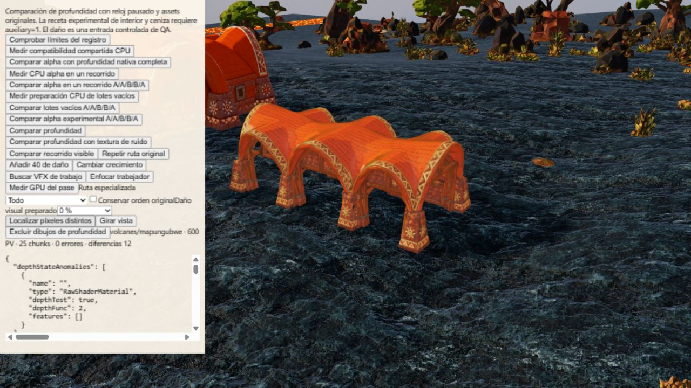

# Exclusión de dibujos: contraejemplo de profundidad alpha

QA aislada sobre main `65fb9114` y los archivos de fixture congelados en
[receipt.json](receipt.json). No cambia producción, materiales ni geometría.
El material alpha especializado continúa desactivado por defecto.

## Método

Volcanes/Mapungubwe, semilla 712, calidad media, reloj simulado fijo; framebuffer
real 1280×720. Secuencia N1/N2/G/B1/B2/N3: N es la profundidad con los materiales
nativos completos, G la salvaguarda de producción, B el candidato alpha de una
sola travesía. Se leen directamente color y profundidad empaquetada reales.

Después, el botón QA «Excluir dibujos de profundidad» retiene uno por uno los
envíos de cada mesh al destino `smokeDepth`, conservando los shaders, materiales,
geometrías y pertenencia a escena. Otros destinos siguen dibujándose. La selección
proviene de N2: 67 meshes, límite de seguridad de 128, primeros ocho píxeles
distintos como sondas. Se comprueba cámara/estado lógico sin cambios y se restaura
el método del renderer incluso ante excepciones. Esto mide participación en esas
sondas; no demuestra propiedad exclusiva de fragmentos ni identifica la causa.

## Resultado

| Par | Píxeles de profundidad distintos |
| --- | ---: |
| N1/N2 | 0 |
| N2/G | 0 |
| G/B1 | 0 |
| N2/B1 | 0 |
| B1/B2 | 12 |
| B2/N3 | 12 |
| N2/N3 | 0 |

Máxima diferencia normalizada: 0,00001996755599975586. B1/B2 conserva los mismos
67 envíos y el estado registrado; cambiar de ruta sí cambia shaders/orden y sus
trazas no son idénticas. No se sube ningún threshold para aprobar el candidato.
Esta reproducción actual difiere de la histórica a 1600×900: no reinterpreta
aquella prueba ni acredita equivalencia alpha.

Dos exclusiones afectan a las ocho sondas: mesh
`e6c47b08-81ea-4f6b-ab4c-09f7c70ffc48` a las primeras cinco y
`228b336c-2cae-42df-9736-4f9f9baf7ce9` a las otras tres. Cada uno retiene un
envío, utiliza MeshStandardMaterial con alphaTest 0,35 y comparte el mapa
`a11f9d8f-4c4e-485c-81f5-396254774fdb`. El control nativo antes/después coincide
exactamente en las ocho sondas; no se evalúan todas las posiciones del framebuffer
en este control de exclusión. No hay errores registrados ni error WebGL final.

Las intersecciones CPU posteriores encuentran los mismos meshes en instancias
0 y 4, con recetas `surface`, `obstruction`, `toon`, sin receta `clip`.
Son candidatos geométricos: el raycast no ejecuta alpha/discard ni desplazamiento
del shader y no prueba propiedad de píxeles. La especie no está identificada por
esta evidencia. El siguiente diagnóstico debe centrarse en estas superficies y
su alpha/discard o estado de binding, sin asumir todavía una causa.

## Evidencia y límites

[Comparación](comparison.json.gz), [exclusiones](exclusions.json.gz),
[candidatos CPU](candidates.json.gz), [recibo y hashes](receipt.json).
Los archivos fuente exactos se conservan comprimidos junto al recibo.
Las nueve pruebas dirigidas de exclusión, trazas e intersecciones pasan:
[log](directed-tests.log). [Sintaxis del fixture](syntax.json) correcta.
No es un benchmark GPU, una reparación aceptada, una prueba móvil ni la matriz
completa de biomas/culturas/estados.

