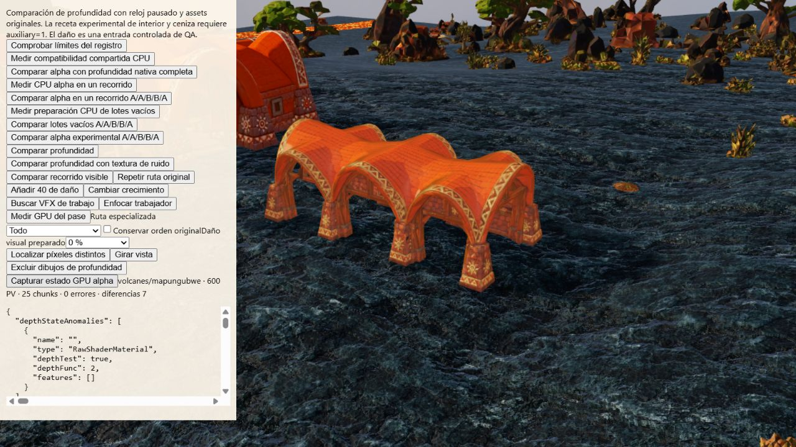

# Estado GPU del contraejemplo alpha

QA aislada, base main `307b8dc9`, Volcanes/Mapungubwe, semilla 712, calidad media,
framebuffer real 1280×720 y reloj fijo. Producción no cambia; alpha especializado
sigue desactivado por defecto. Fuentes exactas, archivos originales y hashes en
[receipt.json](receipt.json).

## Método y límites

Una comparación N1/N2/G/B1/B2/N3 reproduce diferencias. El nuevo botón QA calcula
intersecciones CPU en los primeros píxeles distintos y selecciona sus primeros
candidatos geométricos (máximo ocho meshes). Repite la comparación completa y
consulta WebGL después de sus dibujos reales al destino `smokeDepth`.

Registra fuentes GLSL compiladas, atributos activos y sus ubicaciones, uniformes
activos, bindings de atributos/índice, pipeline y texturas 2D/cube de samplers
compatibles. IDs locales conservan identidad dentro de la prueba. Se restaura la
unidad de textura activa y el método del renderer incluso ante excepciones.
No cambia bindings de buffers ni contenido de texturas/shaders. Las consultas
pueden sincronizar el driver: **no son mediciones GPU/CPU ni evidencia de FPS**.

El raycast no ejecuta alpha/discard y no prueba propiedad exclusiva de fragmentos.
La igualdad de bindings no prueba igualdad de bytes GPU. No cubre todas las
texturas posibles, estados, biomas ni dispositivos. Los shaders guardados son
fuentes entregadas a WebGL, no instrucciones nativas GPU compiladas.

## Evidencia observada

[Antes de instrumentar](before.json.gz) y [comparación instrumentada](probe.json.gz)
tienen los mismos resultados:

| Par | Píxeles distintos de profundidad |
| --- | ---: |
| N1/N2 | 0 |
| N2/G | 0 |
| G/B1 | 7 |
| N2/B1 | 7 |
| B1/B2 | 0 |
| B2/N3 | 7 |
| N2/N3 | 0 |

Máxima diferencia normalizada 0,00001996755599975586. No hay errores del fixture,
WebGL final ni [warnings/errors de consola](console.json). Esta repetición no
reproduce el cambio B1/B2 de la [exclusión anterior](../alpha-depth-draw-exclusion/README.md),
y no explica aquella discrepancia. Los controles nativos permanecen idénticos.

Se observa un mesh por frame, grupo nativo `18:2`: slot 18, LOD índice 2,
«Afloramiento volcánico» en el perfil original. Sus estados GPU registrados B1/B2
son iguales. Frente al shader nativo:

- `modelViewMatrix`, `projectionMatrix`, `mapTransform`, `opacity` y `alphaTest`
  consultados coinciden exactamente.
- La unidad del sampler `map` cambia de 3 a 0, pero apunta a la misma textura
  WebGL, con los mismos filtros y wrap. Esto es una diferencia esperada de
  asignación de unidades, no una textura incorrecta acreditada.
- `instanceMatrix`, `position`, `uv` y `nativeVisibility` tienen los mismos
  bindings/configuración al mapearlos por nombre. Visibility cambia de ubicación
  8 a 7; normales y tangentes no están activos en el shader de profundidad.
- Buffer de índices y pipeline registrado coinciden: depth test/write activos,
  LessEqual, culling/blend/stencil desactivados, mismo viewport/colorMask.

Esto acota la siguiente investigación a diferencias del programa, interpolación
o cobertura efectiva y a estados no medidos. No acredita todavía una causa ni
equivalencia. No se relaja el umbral y no se activa el candidato.

## Verificación e integración

[Doce pruebas dirigidas](directed-tests.log.gz) correctas; comprueban selección de
destino, restauración ante fallos, identidad estable, sampler arrays, trazas e
intersecciones. [Sintaxis HTML](syntax.json) y `node --check` correctos.
No requiere reconstruir los assets: solo cambia el fixture y observador QA.

Las Actions de la optimización anterior `65fb9114` han terminado correctamente:
[Validate](validate-65fb9114.json), [Windows](windows-65fb9114.json), incluidas las
comprobaciones de WebView2 y minimizar/restaurar. No son resultados de esta nueva
instrumentación ni aceptación física móvil/campaña.

