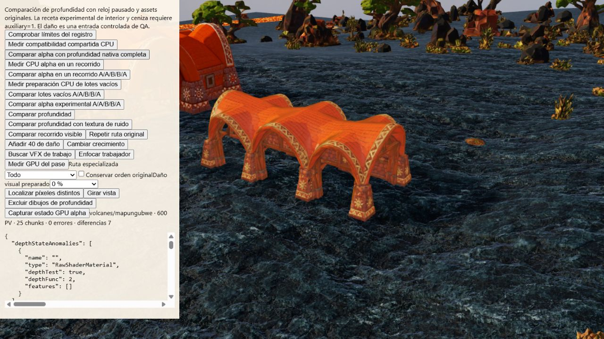

# Hipótesis de invariancia de proyección y UV — rechazada

QA sobre main `67907fbd`, Volcanes/Mapungubwe, semilla 712, calidad media,
framebuffer real 1280×720, reloj/cámara fijos y escena original. El shader alpha
especializado permanece desactivado en producción. Los originales no cambian.

El fixture admite exclusivamente `invariant=position` y `invariant=position-uv`.
El adaptador QA añade `invariant gl_Position` al shader vertex nativo y al de
profundidad. La segunda variante añade también `invariant vMapUv` después de su
declaración stock, solo con USE_MAP. Conserva la cadena de hooks y las recetas
conocidas; no acredita hooks desconocidos. Usa claves de programa distintas y
restaura métodos/recetas al liberar el fixture. No se importa desde producción.

## Resultados

Cada secuencia usa N1/N2/G/B1/B2/N3: dos renders completos nativos, salvaguarda de
producción, candidato alpha dos veces y otro render nativo. La variante UV se
repite dos veces más en el mismo contexto, sin cambiar cámara/reloj. Los números
son píxeles distintos de la profundidad real empaquetada.

| Par | Position | Position + UV inicial | UV repetición 2 | UV repetición 3 |
| --- | ---: | ---: | ---: | ---: |
| N1/N2 | 0 | 0 | 0 | 0 |
| N2/G | 0 | 0 | 0 | 0 |
| G/B1 | 0 | 0 | 7 | 7 |
| N2/B1 | 0 | 0 | 7 | 7 |
| B1/B2 | 7 | 0 | 0 | 0 |
| B2/N3 | 7 | 0 | 7 | 7 |
| N2/N3 | 0 | 0 | 0 | 0 |

Máxima diferencia normalizada cuando hay discrepancia:
0,00001996755599975586. No hay errores del fixture ni WebGL final. Sí hay warnings
de compilación X4000 sobre una variable potencialmente no inicializada en
`f_environment4`: cinco entradas en [Position](position-console.json) y dos en
[Position+UV](position-uv-console.json). No se ha acreditado su relación con la
discrepancia de profundidad; tampoco se usan como evidencia de causa. Ambas
variantes registran 74 materiales envueltos y 107
callbacks de compilación, 40 de MeshDepthMaterial. Las repeticiones UV no añaden
callbacks. El contador de selecciones alpha es acumulativo: 2206, 4412, 6618 en
las tres secuencias UV; no son draw calls ni ahorro.

La primera coincidencia UV se conserva como evidencia, pero **no se reproduce**.
Ninguna variante cumple equivalencia de profundidad repetible. La invariancia no
es una solución suficiente para este caso y no identifica la causa. No se hace
benchmark de un candidato rechazado ni se relaja el umbral. Tampoco se han
comparado píxeles nativos originales contra nativos con invariancia entre
contextos: esta prueba no acredita conservación visual de esa modificación.

Siguiente diagnóstico: inspeccionar contenido efectivo de los buffers y estado
GPU en la transición inicial/repetida, además de shaders e interpolación. La
[sonda anterior](../alpha-depth-gpu-state/README.md) comprobó identidades/bindings,
no bytes. No descartar un problema de contenido solo por compartir Buffer IDs.

## Evidencia

[Position](position.json.gz), [UV inicial](position-uv.json.gz),
[UV repetición 2](position-uv-repeat.json.gz),
[UV repetición 3](position-uv-third.json.gz), [recibo y hashes](receipt.json).
Fuentes exactas congeladas junto al recibo; se mantienen los resultados anteriores.

[29 pruebas dirigidas](directed-tests.log.gz) correctas: conservación/restauración
de recetas, rechazo de hooks desconocidos y varying no declarado, material
envuelto una sola vez, errores/restauración del renderer, materiales stock,
captura, sonda WebGL y activación alpha solo QA. [Sintaxis HTML](syntax.json.gz)
correcta y `node --check` del módulo correcto. No equivalen a una matriz visual
completa, benchmark GPU ni aceptación móvil.

