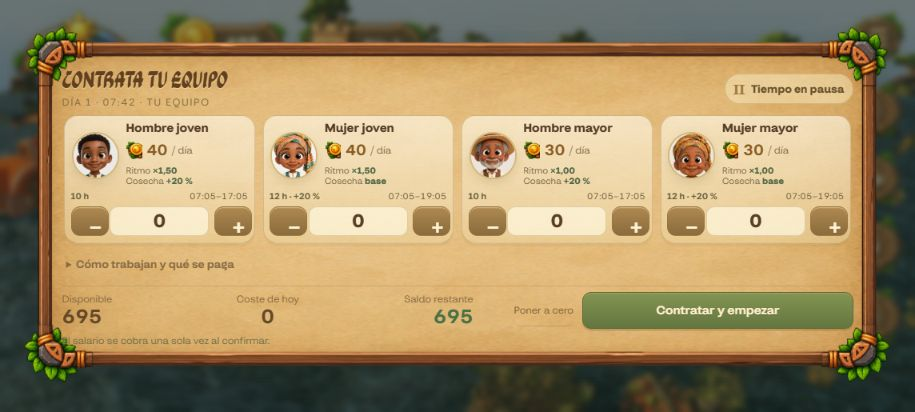
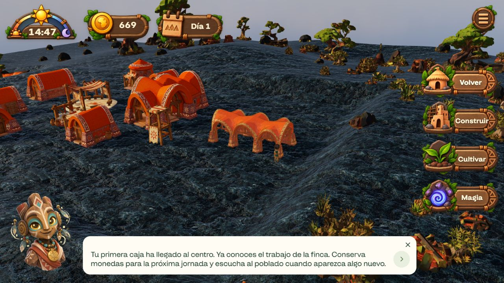

# Recorrido real de inicio — Volcanes / Mapungubwe

Verificación manual con CUA en el navegador integrado, contra Vite `http://127.0.0.1:5191/` y el runtime de `3d1ca1c`. Partida creada mediante el menú y el selector originales; sin créditos, cambio de tiempo, trabajadores, plantas ni eventos inyectados. Idioma español. Esta prueba de onboarding usa una planta; no sustituye la campaña económica intensiva de cien noches.

## Observaciones

1. Menú original → Juego nuevo → Volcanes → Mapungubwe → Comenzar. El árbol accesible mostró la cobertura «La tierra despierta / Preparando terreno, poblado y cultivos originales…» antes de mostrar HUD y tutorial. La captura `first-world.jpg` se hizo después de desaparecer esa cobertura: acredita el mundo inicial, no una captura de la carga.
2. Saldo inicial 1.500. Construir → Centro de trabajo → clic en el lienzo: edificio visible y saldo 700. Se mantiene 07:18 durante los pasos guiados observados y el tutorial avanza a siembra. No se afirma que cualquier punto del bioma sea edificable.
3. Cultivar enumera por precio: mijo 5, sorgo 6, maíz 8, batata 10, yuca 12, girasol 18, algodón 100, plátano 150. Un intento en una pendiente se rechaza con «Agua, lava o pendiente no edificable», sin cobro. Un clic en suelo libre junto a la fachada coloca mijo y deja 695.
4. Sin pulsar ningún botón de contratación, aparece «Contrata tu equipo» al terminar el modo de siembra. Los cuatro retratos están cargados. A 915×412, la variante horizontal mantiene nombres, salarios, contadores, saldo y confirmación dentro del marco. Esta observación de viewport no acredita un móvil físico ni entrada táctil.
5. Contratar un hombre joven cobra 40 una sola vez: saldo 655. El trabajador aparece en el mundo y llega al cultivo; capturas sucesivas muestran su crecimiento. No se ha pulsado una acción de cosechar. A 14:47, el saldo es 669 y el tutorial muestra «Tu primera caja ha llegado al centro…». No se grabó vídeo de todas las animaciones de riego/transporte ni se verificó aquí su sincronía audiovisual.
6. Volver centra visualmente la finca. Guardar y volver al menú muestra una partida Mapungubwe / Día 1 / Volcanes / 669 monedas. Continuarla restaura ese saldo y el encuadre de la finca. Esto es evidencia visual, no una comparación numérica exacta de matrices de cámara.
7. Guardar y volver al menú al terminar elimina el `#stage` del juego (cero coincidencias). Lectura de errores del navegador: lista vacía. Se restableció el viewport y se cerró únicamente la pestaña creada para esta prueba. La partida de QA permanece guardada en este origen local.

La mano 2D dio una imagen cargada y `hidden:false` en la lectura DOM, pero las capturas no acreditan claramente todas las fases de sus gestos 2D/3D. Esa aceptación visual sigue pendiente. Tampoco se cubren incursión, inglés, otros biomas/culturas, calidad gráfica completa, audio subjetivo, wake lock físico, itch.io o Tauri.

