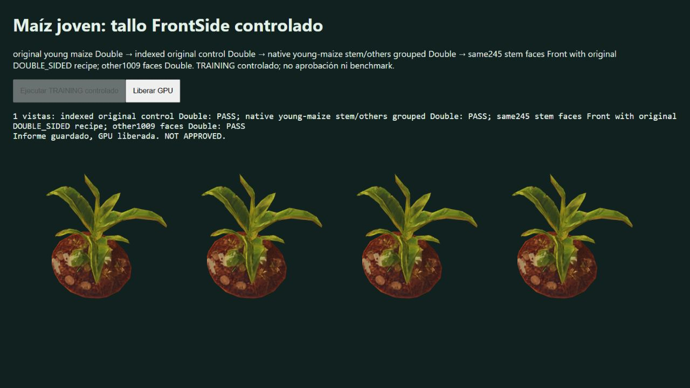

# Native young maize: partial FrontSide training screen

Native browser tab788, frozen02b32b4d, renders original, indexed Double, grouped Double and the same local245stem faces Front with the original DOUBLE_SIDED shader recipe. Other1009faces, native shadow materials, all other growth states and bridges retain DoubleSide. No vertex/UV/normal/winding repair or new faces is applied. Native materials, growth/wind, web textures and shadows participate.

One original-state TRAINING view: maiz_02_joven, growth0.31, clock3.0625, Gran Río/day, azimuth57.625°, elevation46.25°. Three source redraws and the indexed control are byte-exact. Grouped Double passes with one RGB outlier pixel, tileMAE0.0004159435. Front passes unchanged gates: alphaIoU1, no missing/added pixels, linearRGBMAE0.00000120111794, maximum tileMAE0.00379978990 versus0.01 gate; five separate one-pixel RGB regions. This is not exact equality or withheld/multiview/category acceptance.

Pre-draw assertions and captured contracts retain2132vertices/3762Uint16indices/1254triangles, groups735/3027indices, original face IDs and PN/UV values including signed zero. Front material sides0/2, shadow sides2/2, with DOUBLE_SIDED retained only to preserve the source normal/TBN recipe. Per-arm instance matrices/iGrowth fingerprints match. Logical submissions grow from2to4calls including color/shadow, while submitted triangles remain2508. These counters do not measure GPU time or prove a performance gain; the net extra draw overhead still needs benchmarking. Static duplicate-index CPU cost is recorded separately, not peak VRAM acceptance.

Four historical CPU campaigns were live before drawing; no root suite or author GPU scene. No timing claims. Browser warning/error logs empty; renderer disposal/context loss then tab closed. Real screenshot and framebuffer, partial direct source archive and runtime asset manifest record are SHA-bound. Web filename identifies original bytes; runtime SHA identifies compressed bytes. `verify.mjs` checks stored integrity and contracts, not a rendering replay.

No asset promoted or PR approved. Next gates: frozen-selection withheld angles, growth states/bridges, lighting/shadow regressions, topology/behavior/resource preservation and measured net GPU benefit.

