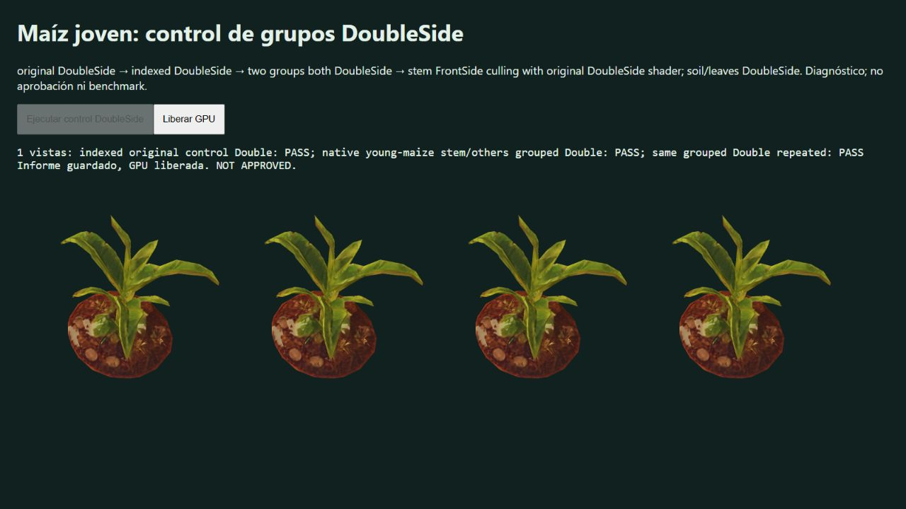

# Native young maize: DoubleSide grouping control

Native browser tab787 tests maiz_02_joven in its real original-state phase (growth0.31), Gran Río/day, clock3.0625, azimuth57.625° and elevation46.25°. Source web GLB, AfricanToon, growth/wind uniforms, original UV/normals and native shadows participate. All four arms are DoubleSide: original, indexed control, locally selected stem/other groups and repeated grouping. No FrontSide or repaired asset is drawn.

Three original repeated controls are byte-identical. The indexed control is exact. Both grouped arms pass the unchanged gates, with alphaIoU1/no missing or added pixels, linearRGBMAE9.8705147e−8 and maximum tileMAE0.0004159435. Each has one RGB outlier pixel at437,485. They pass but are not exact, and this one TRAINING view is not withheld/multiview/category approval.

Captured native contracts show2132vertices,3762Uint16indices/1254triangles and one actual instance. The selected local stem contains245triangles, groups735/3027indices. Every captured color/shadow material usesDoubleSide. Per-arm instance matrices and iGrowth fingerprints match; no geometry repair, winding flip or new faces is applied. Static CPU retention of both index arrays is separately reported by the source correspondence audit as+9.933%; that is not total GPU resident/peak memory acceptance. Grouping adds draw groups, whose net GPU benefit still requires a benchmark after FrontSide quality passes.

The generic visible status line contains an obsolete FrontSide description inherited by the generated fixture. The heading, actual material contracts, report arms and final comparison labels describe the four Double controls. It is retained in the screenshot and disclosed rather than reinterpreting the experiment. The author was asked to correct this in the next isolated fixture.

No browser warnings/errors. Four historical CPU campaigns and the live root full-suite parent/active-farm child were present before drawing (41320,41304,49032,49608,25140,47180); no Blender in that snapshot, and the loading author confirmed no concurrent GPU scene. No timing inference is made. Renderer/resource disposal and context loss complete, then the tab is closed.

Fixture e895e114 and direct sources at5c84cd12, source audits, report and real captures are SHA-256 bound. This is a partial direct source archive, not a full dependency closure. Run `verify.mjs` for stored-result integrity/contract checks; it does not replay native rendering. No production asset is promoted. Next gates: FrontSide quality, more states/bridges/views, shadows, actual resource ownership and measured GPU benefit.

The first archive verifier incorrectly equated the web GLB filename with its encoded-byte SHA and failed. The compression pipeline deliberately retains the original filename: the archived web-assets manifest record identifies original SHA be4bb7e7… and compressed runtime SHA617568fc…. Direct byte hashing confirms the latter in both main and the tested worktree. The corrected verifier checks these distinct identities against the archived manifest record; no asset or visual threshold changed.

