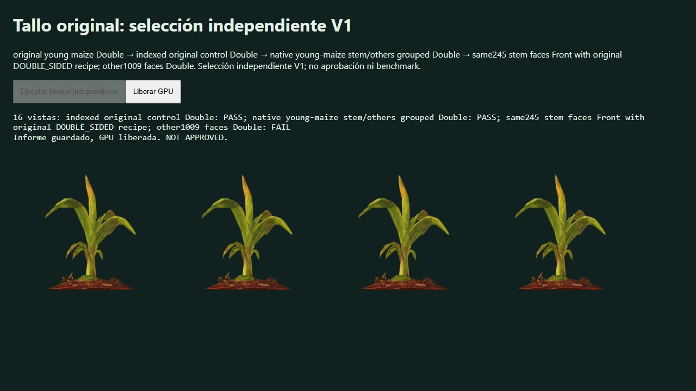

# Native young-maize partial Front: independent V1 rejection

Root native browser789 ran the first26-case block of the previously committed104-case profile. The same245 original young-maize stem faces are Front in the fourth arm, with original DOUBLE_SIDED shader recipe retained; the other1009 faces, other growth states, bridges and shadows remain Double. No geometry repair or added faces. Source/indexed/grouped Double controls are checked before Front. Fixture/profile SHA256 were checked before execution and the browser verified the profile before drawing. Four historical CPU campaigns were live; this is color QA, not timing.

The run stopped at its16th sample (profile index15). First15 samples pass all color gates. Every source repeated draw is byte-exact and both Double controls pass across all16 samples. The failure occurs on Volcanes/day, young native growth0.43562, wind clock6.3125, azimuth351.3125°, elevation−15°:

| Front metric | Result |
|---|---:|
| Alpha IoU |1.0|
| Missing/added pixels |0/0|
| Linear RGB MAE |0.00000343978|
| Maximum16px tile RGB MAE |**0.02054815**, fails≤0.01|
| RGB outlier regions |5 single pixels|

The failure is localized color, despite no silhouette holes and a tiny global average. These measurements do not explain its geometric/shader cause. The prospective threshold is retained. This profile is rejected; later blocks are not run, and the sample is not rerolled or used to fit the same geometry. The earlier single training-view pass does not overturn the rejection.

Report includes actual per-case CPU contracts and logical draws. Grouped arms double logical color/shadow calls, with submitted triangles unchanged; no elapsed GPU or resource-budget acceptance follows. Browser console had no warning/error, fixture exported its report, disposed resources and lost context; root saved the native screenshot and closed tab789. No asset is promoted and no PR is opened. Further genuine geometry repair/recreation remains a separate candidate with preserved originals and unchanged acceptance gates.

`node docs/qa/frontside-native-inputs/maize-young-independent-v1/verify.mjs` validates archived hashes/contracts and the rejection; it does not redraw the screen. Direct fixture/generator/profile/report are preserved, not a full dependency closure. Runtime GLB identity is bound separately from its filename's original-source hash.

