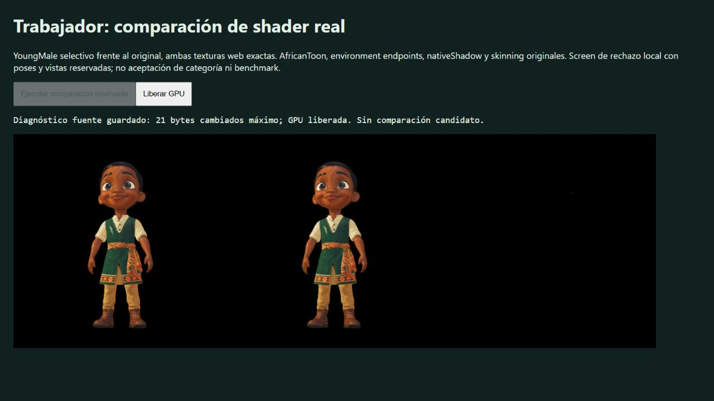

# Whole original worker body: source-only isolation

Native browser tab 786 uses the unchanged original YoungMale Mesh0, all 59853 indices / 19951 triangles, native rig/Idle pose/material/shader and original effective FrontSide. The same full-model camera is calculated before the 24 accessory meshes are hidden. No geometry, normals, UV or animation repair is applied; neither a candidate nor a timed benchmark participates.

The body covers 137604 pixels. Twelve immediate reads of the first framebuffer are byte-identical. Thirty redraws reproduce the previous maximum of 21 changed RGB bytes / seven pixels, with zero alpha differences. The worst 32-pixel tile's linear RGB MAE is 0.0107574373, above the unchanged 0.01 visual threshold. Hiding accessories did not eliminate the observed source-control failure. The earlier seven-pixel single-primitive isolation was stable, but this does not prove the cause of the full-body discrepancy.

All 31 observed draw input records are identical apart from their labels, including uniforms, state, bindings, matrices, source buffer fingerprints and bone readback. FNV fingerprints are diagnostic rather than collision-free proof. Color/depth/environment texels are not re-read in this experiment, so no claim of complete simultaneous GPU input equality or rasterization causality follows.

Four native CPU campaigns were confirmed live before drawing (41320, 41304, 49032, 49608). The loading agent confirmed no concurrent GPU scene. A 9.28-second read-only Blender audit may have overlapped initialization: it was dispatched after permission but before the agent received the opening notice. That uncertainty is recorded; no timing/performance inference is made. Browser error/warning logs are empty. The fixture disposes resources and loses its context on completion; the tab was closed after saving the screenshot.

Sources at commit 58843a84, native report, fixture frame and browser proof are bound by SHA-256. This is a partial direct source archive, with the complete fixture available in the tested branch commit. Run `node docs/qa/frontside-native-inputs/worker-body-isolation/verify.mjs` for stored-result validation; it does not rerun the browser. Neither source-control tolerance nor FrontSide acceptance has been relaxed.

