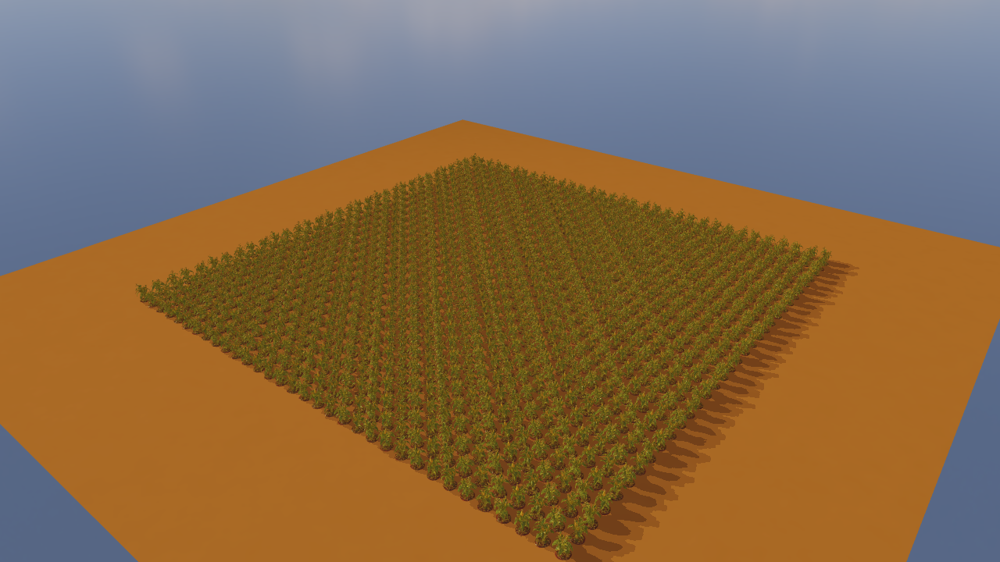

# Mature maize: repaired FrontSide net GPU benefit

Native experiment on 8 October 2026, frozen fixture `519f7d01`, JS hash
`c55fa37d…`. Intel UHD/ANGLE, 1280×720, 1089 fully mature maize plants,
fixed camera [40,35,50], FOV42, wind1.75. Original DoubleSide arm0 versus
Blender leaf-reduction candidate arm3 with shared reverse indices and FrontSide
color. Both retain DoubleSide native shadows. Queries include clear, native
sky, color and native shadow rendering on a simple receiver.

Six prospective AB/BA pairs, 120 warmup draws and 300 elapsed queries per block:
3600 valid samples, no pending/disjoint/discarded/skipped/foreign/allocation-failed
queries. No reroll. Source shader, camera, clock and draw workload stayed frozen.

| GPU statistic | Original | Candidate |
|---|---:|---:|
| Median | 81.980286 ms | 67.653463 ms |
| p95 | 83.314322 ms | 69.146354 ms |
| Submitted calls | 4 | 8 |
| Submitted triangles | 10,748,433 | 10,741,899 |

Median savings **14.326823 ms / 17.47594%**. Paired-block mean savings 95%
bootstrap interval [14.195569,14.421233] ms. All prospectively defined GPU gates
pass (including p95). The extra groups/draws are already included; this is the
candidate's net result, not the earlier unrepaired FrontSide ceiling.

This supports continuing the repair approach for this representative asset.
It is not a 17.5% whole-game or FPS claim, nor acceptance of all crops/workers.
Growth transitions, full-world visual inspection, packaging, rig/morph/UV
compatibility and broader regression remain independent requirements. The
numeric visual thresholds remain diagnostic under the user's policy3.

Resources were measured separately in tab857 with BUFFER_SIZE queries and no
timer campaign. Original warm arm uses 481082 bytes/11 buffers. Drawing the
candidate as well brings coexistence to 895410 bytes/17 buffers: an additional
414328 bytes (250488 candidate geometry +163840 instance storage). Candidate
geometry is 66578 bytes smaller than the original's 317066 bytes; retaining
both representations still increases the total. This is not a measured
standalone deployment budget or physical RAM/VRAM result. Textures remain7;
geometries3→4/programs4→7 coexist. Cleanup ends at zero observed buffers/bytes.

Both contexts report cleanup closed, errors[] and contextLost true, and were
closed sequentially with empty final inventory. The four old CPU campaigns
were absent. No Blender/build/full-suite ran concurrently; small loading-agent
CPU helper checks and source reads occurred. CPU/thermal conditions were not
isolated. Timing and resource probes must not be pooled.

Raw exported reports, PNGs and fixture/source hashes are preserved. The final
PNG is the last original-arm draw, not a side-by-side visual acceptance. The
archived deterministic analyzer is copied from the frozen fixture and hashed.
`node docs/qa/frontside-source-control/shared-leaf-net-gpu/verify.mjs` verifies
integrity, recalculates all GPU gates and checks observed cleanup/resource
invariants; it does not rerun the native experiment.

