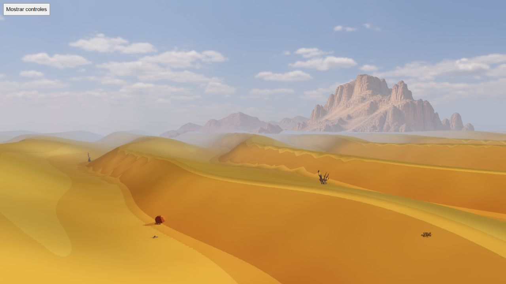
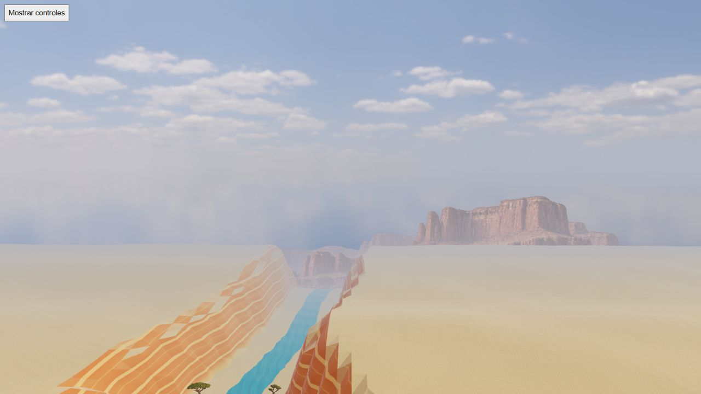
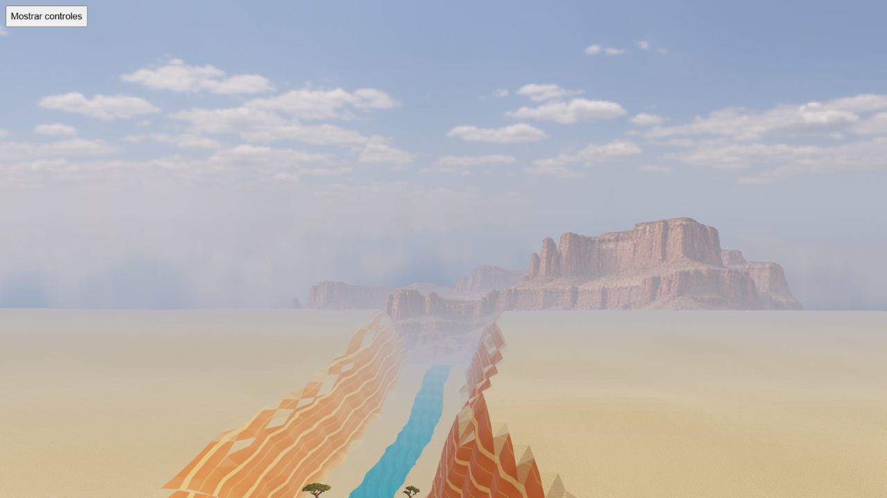

# Four-cell HQ mountains: Desierto and Gran Cañón

Native capture source da824a1e, Mapungubwe/seed712/media. Four rotations contain 292 poses, unchanged logical state, no reported errors and GL error0. Sixteen selected day/night screenshots at yaw0/95/185/275 were inspected. Source, atlas/layout and report/screenshot hashes are bound by the receipt. Drawing buffer1600×900; screenshots1280×720. Configuration: four cells, base fog1, no vertical shift, mipmaps enabled, one sampler. Elevation is4 above the native eye in Desierto and80 in Gran Cañón.

## Desierto

The four distinct rocky profiles leave wide open intervals and retain detailed relief with coherent day/night colour. No stacked horizontal cutout endpoints like the volcanic negative were apparent in these selected views. Atlas839410 bytes. This accepts their visual direction, not all inclinations, temporal shimmer, physical mobile or production integration.

## Gran Cañón — remaining composition and anchor limitations

Three selected directions show distinct detailed mesas with bases partly hidden by the native plateau. At yaw275 the fourth silhouette is effectively obscured, including at the elevated eye used here. Its contact and composition are not visually approved by an invisible image. Atlas692894 bytes. The QA elevation is a review angle, not a replacement for the gameplay camera.

## Horizontal displacement exposes vertical backdrop movement

After both rotations, the Move control adds20m to eye X without changing eye Y or direction. The separate static report retains:

| Value | Before | After |
| --- | --- | --- |
| Eye X | -39.70382733910226 | -19.70382733910226 |
| Eye Y | 95.49144402847398 | 95.49144402847398 |
| Anchor X | -39.70382733910226 | -20.30374735190019 |
| Anchor Y | 2.8738318133130583 | 21.84637056626417 |

The19.0m vertical change comes from `createBiomeBackdrop.update` setting rootY to `field.surface(camera.x,camera.z)`. Horizontal parallax is bounded, but this height follows the local cliff beneath the eye. The two selected screenshots show the mesas rising with that terrain change. This is retained as a limitation to correct before approving the integrated backdrop: use a coherent stable altitude rather than visibly shifting the horizon across local slopes. Continuous movement, reverse travel and camera-only elevation need subsequent validation. Do not infer interpolation smoothness from this single displacement.

Raw rotations preserve unchanged logical state; the displacement report is a static snapshot, not an independent state-parity run. Both tabs were disposed/closed. No GPU timing, memory byte, actual driver LOD, complete river continuity, mobile or public asset replacement claim follows. Revised Volcanes and corrected Canyon anchor/composition remain pending before PR/integration.
