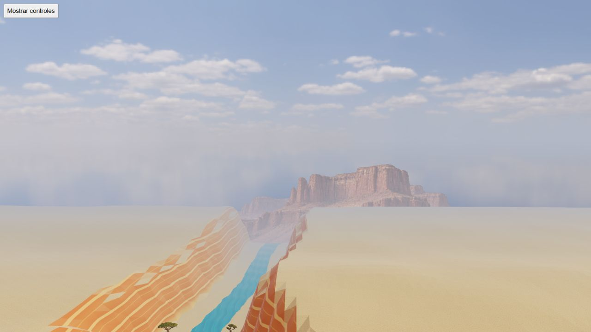

# HQ mountains: elevation and atlas footprint controls

Six native browser rotations contain 438 poses (73 each), unchanged logical state, no reported errors and GL error 0. Raw reports are preserved losslessly as gzip. The receipt binds source hashes, layouts, atlas bytes and all screenshots to capture harness aab1a134. The branch advanced only offline assets to a9b94ae3; Git verified no harness/module differences before archiving.

## Gran Cañón

The single-cell candidate was rotated during day and night at elevations 80 and 180 above the native eye. Four selected yaw-0 screenshots were visually inspected. At elevation 80 the detailed mesa silhouette and day/night toning are coherent with the scene; the native plateau partially occludes its base. At 180 the framing is mostly sky, so it is a visibility control rather than a recommended final camera composition. This extends the earlier pilot whose native eye hid the mountains behind cliffs. It does not approve every inclination, contact edge or the final four-cell composition.

## Sabana atlas footprint

The four-cell 2048×512 atlas retains mipmaps and LinearMipmapLinearFilter. The diagnostic estimates LOD from UV derivatives before discard, keeping the single texture lookup. It does not query the driver's actual mip level. Blue/green indicates estimates below level 4, orange 4–5 and magenta at least 5. Separate CPU evidence retains the negative finding that sufficiently coarse atlas mips mix cells.

Two day rotations use drawing buffers 1600×900 and 320×180. The latter is a reduced browser viewport with effective DPR approximately 1, not a physical mobile test. At yaw 0/95/185/275, all eight selected screenshots were inspected: native views are blue; small views are turquoise/green, without visible orange or magenta. Reports contain pose metadata, not a pixel histogram or quantitative LOD maxima. This observation cannot establish that every pixel of all 146 poses stays below level 4.

No change to the production filter policy follows from these static controls. Temporal shimmer, actual driver sampling, mobile rendering, GPU timings, RAM and full camera inclination acceptance remain pending. The diagnostic screenshots intentionally replace mountain colour with a heatmap; they are not the final mountain artwork.
