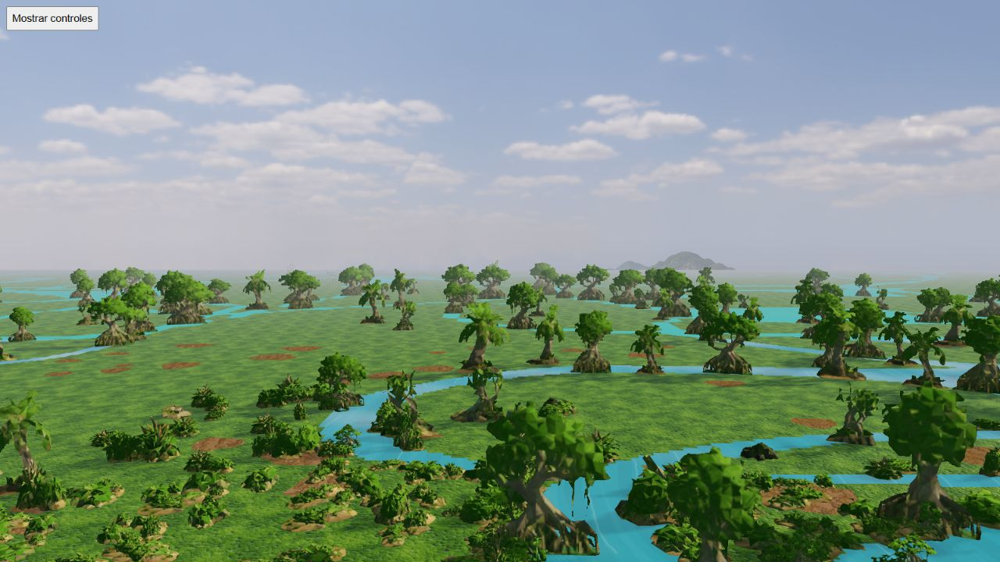
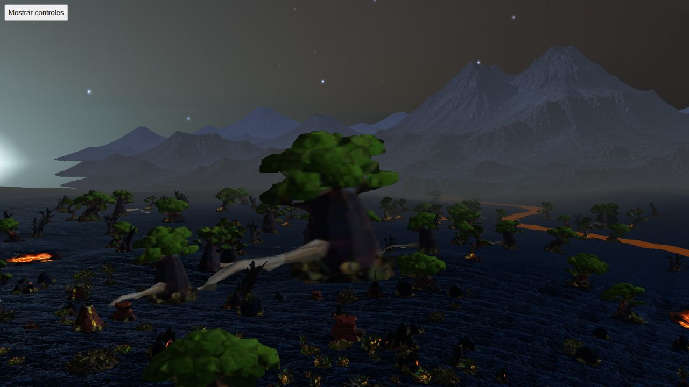

# Four-cell HQ mountains: Manglares and Volcanes

Capture source da824a1e, Mapungubwe/seed712/media. Four native rotations contain 292 poses, unchanged logical state, no reported errors and GL error 0. Sixteen selected yaw 0/95/185/275 day/night screenshots were inspected. Receipt hashes bind the source files, atlas/layout inputs, raw compressed reports and screenshots. Drawing buffer 1600×900, screenshots 1280×720. Configuration: four cells, elevation4, base fog1, no vertical shift, mipmaps enabled, one sampler.

## Manglares — direction accepted in selected views

The low relief is discreet and leaves an open wetland horizon. Day/night colour and atmospheric contact are coherent in the selected views; yaw275 is mostly hidden below the terrain/vegetation horizon. Visibility of every silhouette is not forced. Atlas791354 bytes. This does not approve every inclination, animation or physical mobile rendering.

## Volcanes — silhouette correction required

The generated relief has substantially more detail, but its flank endpoints form stacked horizontal pointed shelves. Against the night sky these look like suspended cutouts rather than natural slopes. They are visible at yaw0 and also in other selected orientations. The candidate is **not approved for production** despite clean GL/state controls and a valid atlas export. Atlas779698 bytes.

Correct the source artwork while preserving this negative result; do not hide it with a more costly shader or label it an established GPU/mipmap defect. Reinspect the revised four-cell composition in day/night before promoting assets.

## Displacement control

After the Volcanes rotations, the native Move control displaced eye X by20m. A separate static snapshot and screenshot preserve the result: cameraX96.70247532024266, anchorX96.10255530744473/anchorY12.484385706572814; original anchorX76.70247532024266/anchorY13.666690115841753. The anchor follows the native ground sampling and smoothing. The shelves remain visible after displacement. This single view is not a continuous parallax, shimmer or unchanged-logical-state rotation proof.

All tabs were disposed/closed. No benchmark, driver mip-level, RAM, physical-mobile or public asset replacement claim follows. Remaining: revised Volcanes, four-cell Desierto/Cañón and an isolated integrated cost comparison.
