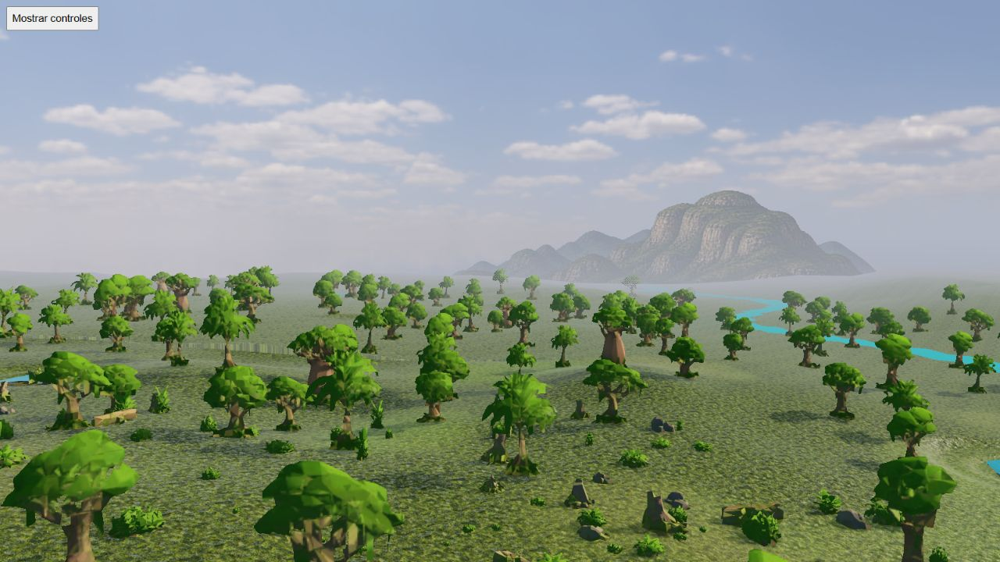
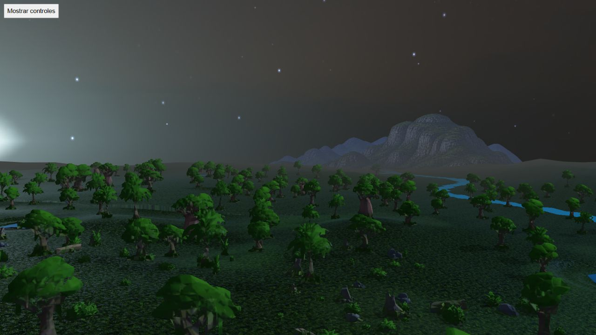

# Gran Río: four generated HQ mountain silhouettes

Native browser QA on branch commit 9b6b39eb, Mapungubwe/seed712/media. Two complete fixed-eye rotations contain 146 poses, with unchanged logical state, no reported errors and GL error 0. The receipt binds harness/module hashes, atlas and layout to losslessly compressed reports and eight screenshots.

The atlas is 2048×512, 737,754 bytes, with four distinct generated silhouettes. Configuration: four cells, base fog 1, no vertical shift, elevation 4 above native eye, mipmaps enabled, one sampler. Drawing buffer 1600×900; screenshots 1280×720. The backdrop composition uses 96 triangles. Overall scene counters are recorded, not isolated GPU timing or memory bytes.

Selected yaw 0/95/185/275 frames were visually inspected during day and night. Relief is substantially more detailed than the previous low-poly artwork; heights and angular gaps keep the horizon open. In these views there is no obvious colour halo, stretched outline or repeated mirrored peak. Atmospheric bases merge with the terrain, and night toning belongs to the same scene. Occlusion by native terrain/vegetation is retained rather than forcing every silhouette to be visible.

This accepts the visual direction in the selected Gran Río views, not every frame or camera inclination. No frametime benchmark, physical mobile, temporal shimmer, full river continuity proof or production asset replacement follows. Other four-cell biomes and integrated rollout remain pending. Raw reports cover rotations; screenshots cover the stated selected views only. The QA tab was disposed and closed after capture.
