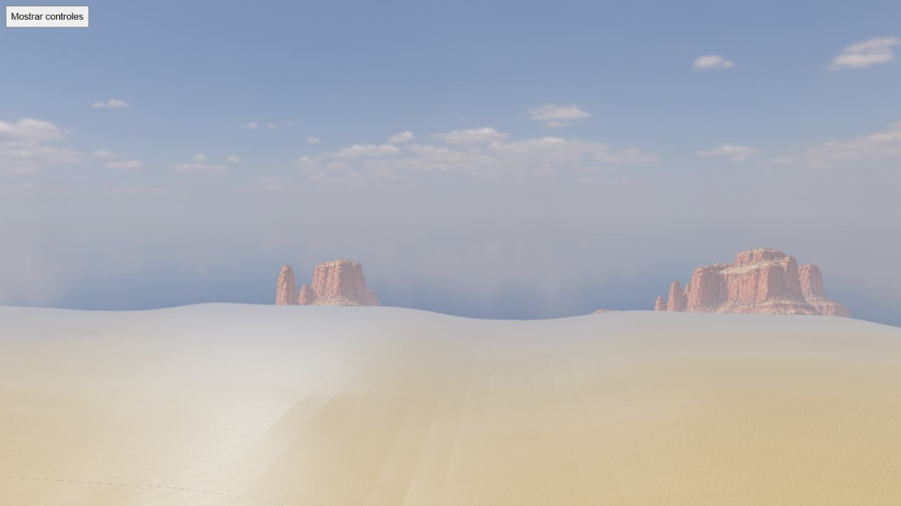
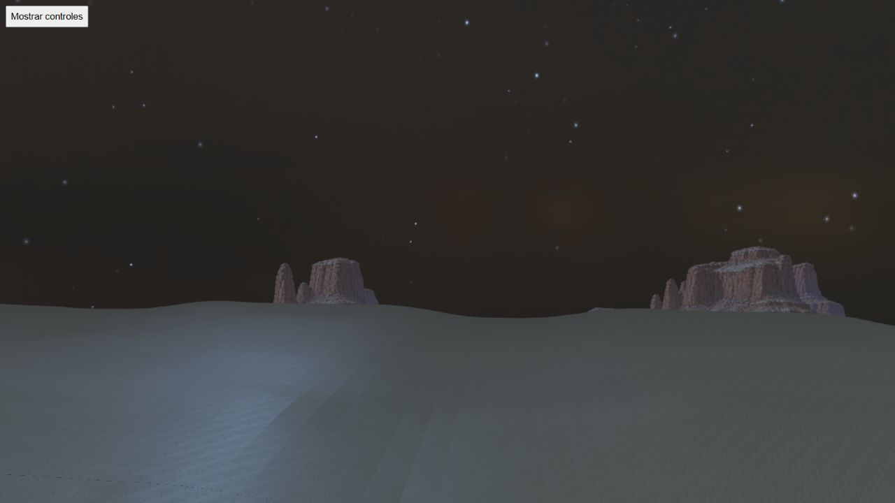

# HQ mountains through the configured public profile

Root review of PR #7, fixed source `32d546c1`. The native WorldScene load uses
the normal configured far-vegetation profile; no cache-backed atlas adapter is
installed. The two original receipts identify `runtimeHQ:true` and the public
`/assets/far-vegetation/canyons-hq-backdrop.webp` URL, 2048×512, one sampler,
stable altitude Y=2.36, 1280×720 buffer, zero page errors and GL=0.

Selected Gran Cañón/Mapungubwe views, seed712, medium quality, yaw275° and
elevation80m, retain the reviewed fourth silhouette in day and night. The public
integration reproduces the intended detailed mesas, open valleys and night
tint. The elevation is diagnostic, not the normal gameplay camera pose.
Texture memory counters include QA resources and are not a gameplay RAM metric.
The world was disposed and tab721 closed after the review; viewport restored.

This proves selection/rendering through the public configuration at these two
poses. It is not all-biome timing, temporal shimmer or physical mobile acceptance.
The earlier six-biome source reviews and Sabana cost experiment retain their
respective limits. CI/merge status must be inspected separately; these receipts
were captured before merge while CI was running. Source and capture hashes are
stored in `receipt.json`.

