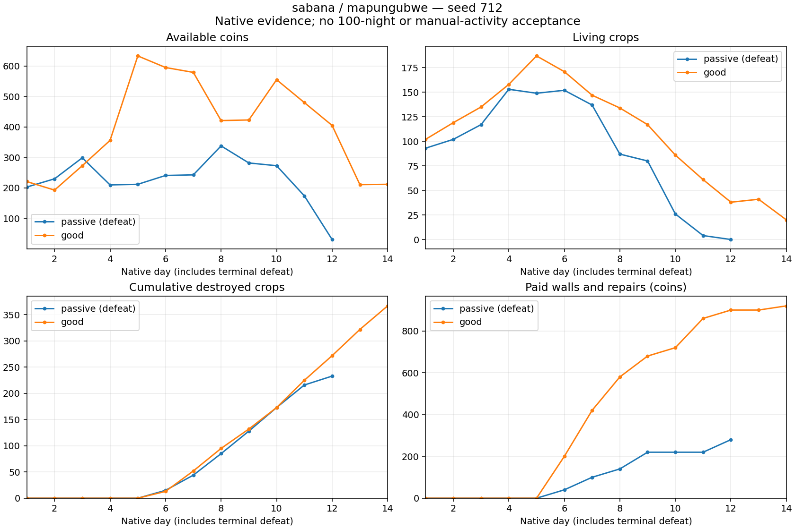

# Rolling defense funding: fourteen-night extension

Both campaigns used frozen source `6ebbce38`, seed 712, Sabana/Mapungubwe, olderFemale, Q9, cashflow crops, shore defenses from day six, empalizada, rolling funding, breach-first repairs and 1.5 fluid clearance. Crop resistance is one direct impact. Prices, wages, magic budgets and military pressure v3 are unchanged. These are native observations, not projections or acceptance of the final balance.

## Verified outcomes

| Policy | Survived nights | Terminal coins | Living plants | Destroyed plants | Delivered income | Wages | Seeds | Walls | Repairs |
|---|---:|---:|---:|---:|---:|---:|---:|---:|---:|
| Passive, no agricultural magic | 12; native dawn defeat | 31 | 0 | 233 | 5,674 | 2,324 | 3,739 | 280 | 0 |
| Good, moderate agricultural magic | 14; observed horizon | 212 | 20 | 367 | 11,359 | 4,391 | 6,536 | 920 | 0 |

Opening spendable cash after the paid 800-coin centre is 700. Exact reconciliations are `700 + 5674 - 2324 - 3739 - 280 = 31` and `700 + 11359 - 4391 - 6536 - 920 = 212`. Passive centre health is 288; active centre health is 600. No fictitious deliveries, duplicate debits or technical failure are classified as defeat.

All 311 passive and 438 active assigned strikes were consumed through native resolution. Post-introduction destroyed plants divided by the native raid-start census are 32.41% and 31.05%. Different agricultural value and RNG histories produce different compositions under the same pressure formula; neither policy receives an artificial damage multiplier.

Terminal, census, worker settlement and actual wall-allocation audits passed. All 51 paid wall strokes stayed within the rolling allocation and protected payroll/minimum seed bound. The full frozen sources match between the pair. Both extensions reproduce **every complete daily row** of their respective seven-night pilots v73/v74, with identical full source hashes. Receipts, manifests, reports, daily JSONL and native snapshots are preserved.

## Why seven-night survival was insufficient

Neither policy completed a certified perimeter even once. Passive paid 14 pieces and still quotes 760 coins of unfinished work; active paid 46 pieces and still quotes 560. These quotes are future purchases, not debts. Both recorded zero repair requests and zero repair settlements. The partial walls did receive physical hits, but a complete defensive enclosure was never established.

Passive stock falls from 137 plants after night seven to zero after night twelve. Active stock falls from 147 after night seven to 20 after night fourteen. Its observed-horizon receipt therefore does not demonstrate sustainable farming. Rolling allocation relieved the earlier whole-contour saving trap, but spending half of discretionary funds on construction did not close these empalizada contours quickly enough. The evidence does not show that agricultural magic must be compulsory or that completed walls fail physically.

Do not extend this candidate to 100 nights. Next diagnostic: keep the same QA allocation and all native parameters, choose the **existing** zarzas material (10 coins/100 HP instead of empalizada 20/200), and run seven-night passive/active pilots. This changes a player purchase decision, not wall prices or damage. Check actual closure and repair/interception before extending a promising result. Weaker walls may fail; that outcome must also be retained.

The decision-window idle proxies are 79.22% and 68.79%. They do not measure human manual action durations and do not approve the below-25% activity requirement. No GPU, visual gameplay, hundred-night or postgame acceptance is inferred from these audits.

Evidence: `pilot-v75-v76-terminal-audit.json`, `pilot-v75-v76-census-audit.json`, `pilot-v75-worker-audit.json`, `pilot-v76-worker-audit.json`, both allocation audits and both prefix comparisons. The chart was visually checked for labels and exact observed end points; it is a data visualization, not rendered gameplay QA.
