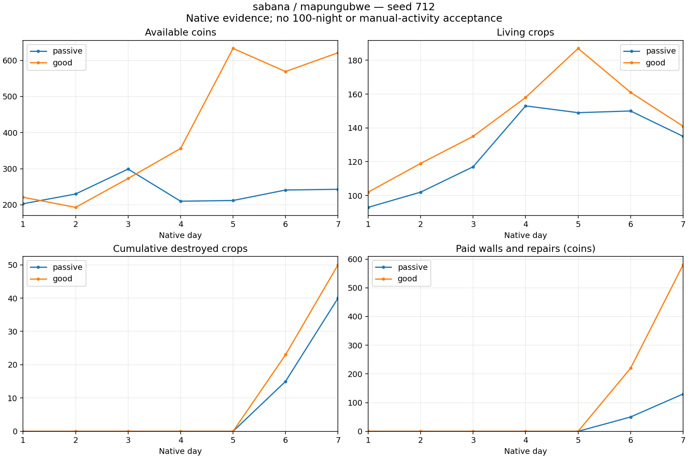

# Existing zarzas choice: seven-night native diagnostic

Frozen source `d1ebfef8`; seed 712, Sabana/Mapungubwe, olderFemale, Q9, cashflow crops, shore defenses from day six, rolling funding, breach-first repairs and 1.5 fluid clearance. The only changed player decision versus v73/v74 is buying **zarzas** instead of empalizada. Their existing prices and HP remain 10/100 and 20/200. Native code/content, all source hashes and every complete row of the first five days match the corresponding prior pilots exactly.

| Policy | Observed nights | Coins | Live plants | Destroyed plants | Income | Wages | Seeds | Walls | Repairs |
|---|---:|---:|---:|---:|---:|---:|---:|---:|---:|
| Passive | 7 | 243 | 135 | 40 | 3,606 | 1,424 | 2,509 | 130 | 0 |
| Good, moderate agricultural magic | 7 | 621 | 141 | 50 | 5,818 | 1,991 | 3,326 | 580 | 0 |

Both native observed horizons survived with all 74/74 and 75/75 assigned strikes consumed. Actual ledger equations: `700 + 3606 - 1424 - 2509 - 130 = 243`; `700 + 5818 - 1991 - 3326 - 580 = 621`. Terminal, census, exact worker settlement and rolling wall-allocation audits passed. The 36 paid strokes are real native purchases; no repair requests or payments occurred.

Neither farm closed a certified perimeter. Passive bought 13 pieces and still quotes 340; active bought 58 and still quotes 160. The active raids on nights six/seven registered no wall hits, so this pilot does not establish protective efficacy. More affordable geometry alone is not acceptance. Its remaining quote makes an extension to fourteen nights useful to observe closure, breach, paid repair and subsequent stock; passive recovery remains unproven as well.

No prices, pressure, strike budgets, crop resistance, magic or workforce rules were changed. Later results are not a fixed-composition damage experiment: legal placement, deliveries, agricultural value and RNG consumption can differ after the material choice. No synthetic loss/bonus or free reconstruction is introduced.

Preserve these seven-night source manifests and native snapshots. The next paired fourteen-night runs must reproduce their entire seven-day prefix before new outcomes are accepted. Do not run 100-night campaigns from seven-night survival alone.

The idle decision-window proxies (76.29% passive, 68.29% active) are not measured human manual durations and do not approve the below-25% requirement. Hundred-night survival, economic sustainability, postgame and GPU/visual gameplay coverage remain unverified.

Evidence: paired terminal/census audits, individual worker/allocation audits and `pilot-v73-v74-v77-v78-before-defense-comparison.json`. Chart labels and endpoints were visually reviewed.
