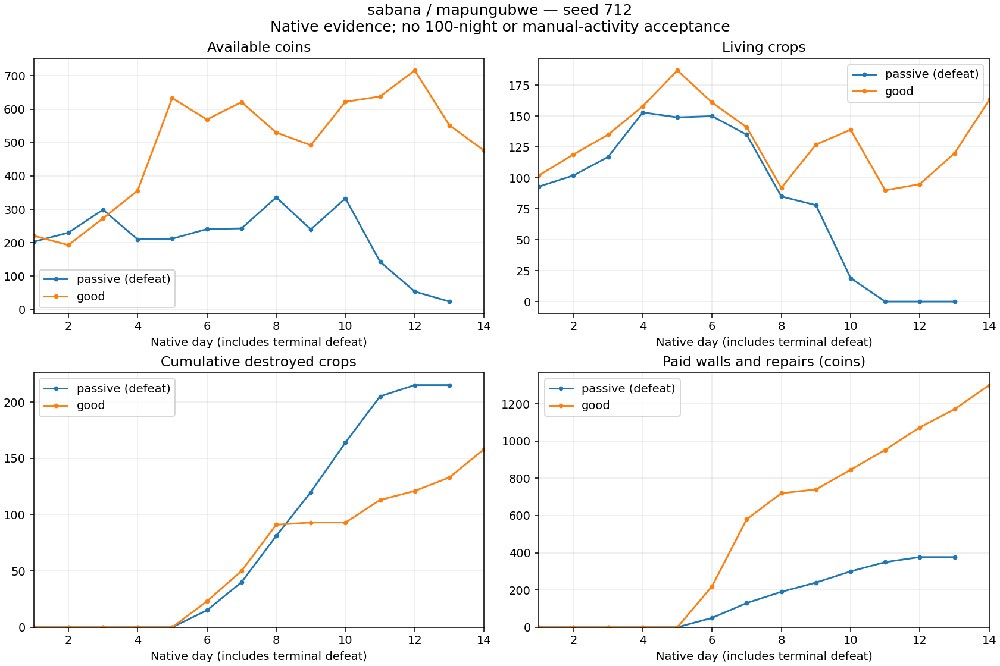

# Zarzas: closure, native repairs and fourteen-night outcomes

Frozen source `e03caa7c`; Q9, olderFemale, cashflow crops, seed 712, Sabana/Mapungubwe, shore defense from day six, zarzas, rolling funding, breach-first repairs and 1.5 fluid clearance. Native code, crop resistance, military candidate v3, wages, prices and magic power budgets remain unchanged. Both runs reproduce every complete daily row and every frozen source hash of their seven-night pilots v77/v78.

| Policy | Terminal observation | Coins | Living plants | Destroyed plants | Delivered income | Wages | Seeds | Walls | Repairs |
|---|---|---:|---:|---:|---:|---:|---:|---:|---:|
| Passive | Defeat during night 13; 12 survived | 24 | 0 | 215 | 5,674 | 2,324 | 3,649 | 360 | 17 |
| Good, moderate agricultural magic | 14 nights survived | 476 | 163 | 158 | 13,252 | 5,125 | 7,050 | 740 | 561 |

Exact balances: `700 + 5674 - 2324 - 3649 - 360 - 17 = 24`; `700 + 13252 - 5125 - 7050 - 740 - 561 = 476`. Passive has no operational centre at termination; good retains its 600-HP centre. All 343/343 and 472/472 assigned strikes were consumed natively. No timeout or technical failure is classified as defeat.

## Physical defense

Passive bought 36 pieces but never recorded a complete contour; its unfinished quote is 370, not a charged debt. It registered 52 wall contacts, 1,117 wall HP lost and 22 centre contacts. Its crops were exhausted by night eleven, then a small replant was lost on night twelve. The final day hires one worker for 30 from 54 coins, with no new seedlings bought, and the centre is subsequently lost. This deserves a player allocation/purchase-timing diagnosis before changing military power or declaring magic obligatory.

Good completed its contour on day nine at approximately 55 simulated seconds. Its 74 pieces cost 740; remaining construction quote is zero. Actual contacts total 266 against walls, causing 6,392 wall HP loss, with zero centre contacts. Paid repairs are 561; they are actual ordered ledger debits, not fees on intact walls or fictional charges. Stock recovers from 92 after night eight to 163 after night fourteen, while cash ends at 476. This warrants a 21-night extension, not 100-night approval.

After the five introductory nights, weighted destroyed/exposed fractions are 31.52% passive and 12.29% good. The good fraction includes the still-open nights six through eight and later breaches; it is not a guaranteed protected-loss multiplier. Different agricultural values and RNG histories produce different actual compositions under the same pressure formula. Future calibration must use physical observations, never synthetic removals.

The advisory repair curve, evaluated on night-spawn plant census, totals 1,199.796 and 1,884.333. Actual 17/561 repairs are lower; these partial/short observations do not justify extra maintenance charges or mechanically increasing attack damage. Record closure, breach, paid repair and production over the next native horizon first.

## Evidence and next action

Paired terminal, census, worker settlement, actual wall-allocation, defense contact/cost and exact seven-day prefix audits all passed. The 61 paid wall strokes preserve their actual settlement order. Snapshots, source manifests, daily rows, receipts and negative results are retained. The chart was visually reviewed for exact terminal day/cash/stock labels.

Extend the good policy to 21 nights with identical settings. Replay passive with the existing read-only purchase observer and require exact daily/source equality, including its native defeat. Do not adjust prices, hordes or farmer rates to compensate for an unexamined automated allocation failure. Further seeds, Gran Cañón, all six strategies, 100/180 days and postgame price variants remain required.

Decision-window idle proxies are 81.23% passive and 66.93% good, not measured human manual action durations. No below-25% activity, visual gameplay, GPU or final integrated acceptance is inferred.

