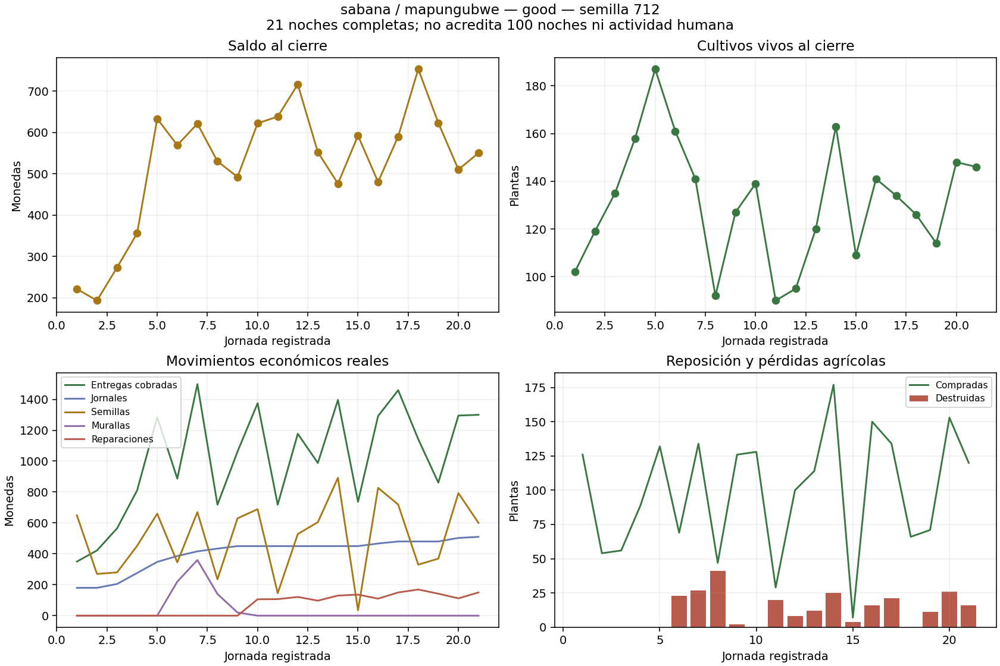

# Active zarzas: twenty-one-night native extension

v81 used frozen source `c18ebce8`, seed 712, Sabana/Mapungubwe, Q9 olderFemale, cashflow crops, moderate agricultural magic, shore zarzas from day six, rolling funding, breach-first repairs and 1.5 fluid clearance. All fourteen complete daily rows and full source hashes match v80 exactly. No native prices, crop health, magic budgets, military parameters or worker rates changed.

The campaign survived all **21 nights**, ending with **550 coins, 146 live plants and a 600-HP centre**. There were 252 destroyed plants, 74 purchased wall pieces, 740 wall coins and 1,530 actual repair coins. All 981 assigned strike budgets were consumed through native attack resolution; no unused budget or technical failure is presented as performed damage.

| Paid native category | Total coins |
|---|---:|
| Delivered harvest income | 21,338 |
| Wages | 8,495 |
| Seeds | 10,723 |
| New walls | 740 |
| Repairs/reconstruction settlements | 1,530 |

Exact ledger: `700 + 21338 - 8495 - 10723 - 740 - 1530 = 550`. The opening 700 is after the real 800-coin centre purchase from 1,500. Income matches physical crate deliveries, rather than mature plants, requested harvests or future production.

The first recorded complete contour remains day nine at 55 simulated seconds. There are 624 native wall contacts, 15,128 actual wall HP lost, 142 shield contacts and zero centre contacts. The remaining construction quote is zero at termination. Alternative agricultural potential totals 1,291.5 HP, while actual agricultural damage is 252 HP. Structural and agricultural alternatives are not added as performed damage.

Stock fluctuates after closure: 163 on day fourteen, 109 on fifteen, 141 on sixteen and 146 on twenty-one. Cash rises from 476 to 550 over that final week. This is more promising than the unclosed empalizada rolling candidate, but **does not prove a hundred-night sustainable equilibrium**: wages reach 510 on day twenty-one and the pressure continues to rise after this horizon. Post-introduction weighted crop destruction is 10.97%, including the three pre-closure nights and real breaches; the 3.64% advisory protected reference is not forcibly applied.

The advisory repair-curve sum is 2,841.765, compared with 1,530 actually paid. The curve includes introductory and pre-closure nights; this is not evidence to charge extra maintenance or mechanically increase damage. A higher-quality wall choice or improved allocation may be useful later, but must be executed through real native commands and diagnosed separately.

Terminal/ledger/delivery, census, worker settlement, paid wall allocation, physical contact/cost and exact prefix audits passed. Reports, snapshots, source manifests and all historical negatives remain retained. The data chart was visually reviewed; it is not gameplay visual QA.

## Remaining gates

Do not launch definitive 100/180 campaigns or merge main from this one active seed. The fourteen-night active extensions for 123/2026 and early passive recovery for 712 are running at this checkpoint. Gran Cañón/Saheliana, all six comparable policies, physical optional-magic viability, poor-management defeats and the full postgame variant comparison are still required.

The non-magic decision-window idle proxy is 66.33%; it is not measured human activity and cannot approve the below-25% requirement. CPU/GPU performance and actual UI/persistence/rendered regression remain separate gates. Both official browser and Windows computer-use runtimes were probed on 11 October and failed to initialize kernel assets with missing-path error 3; no alternate synthetic visual acceptance is substituted.

