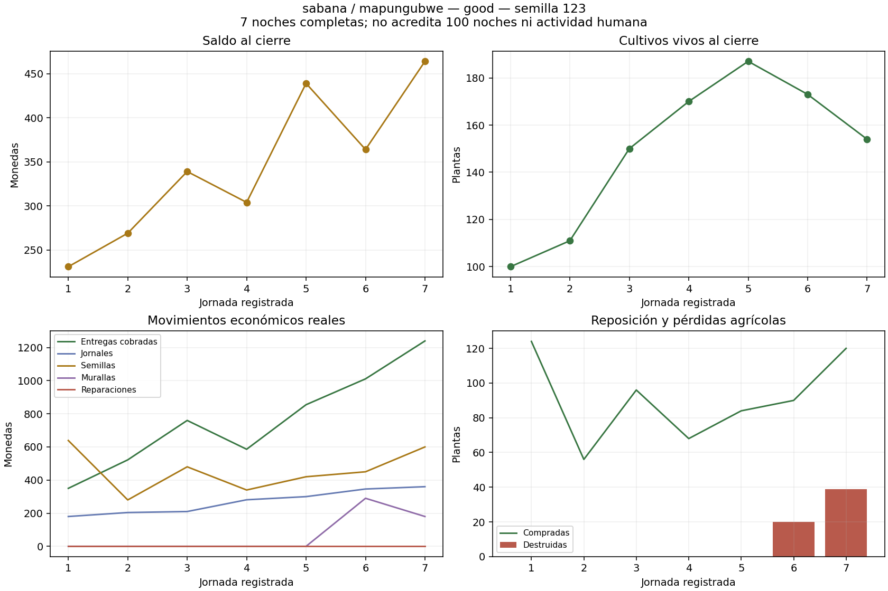
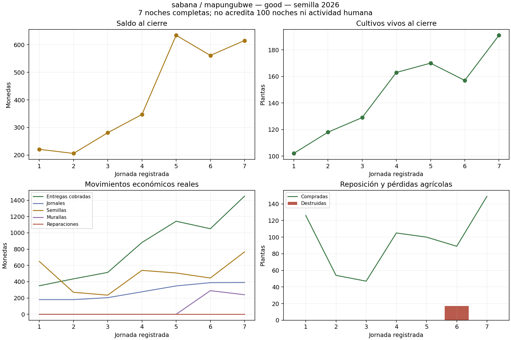
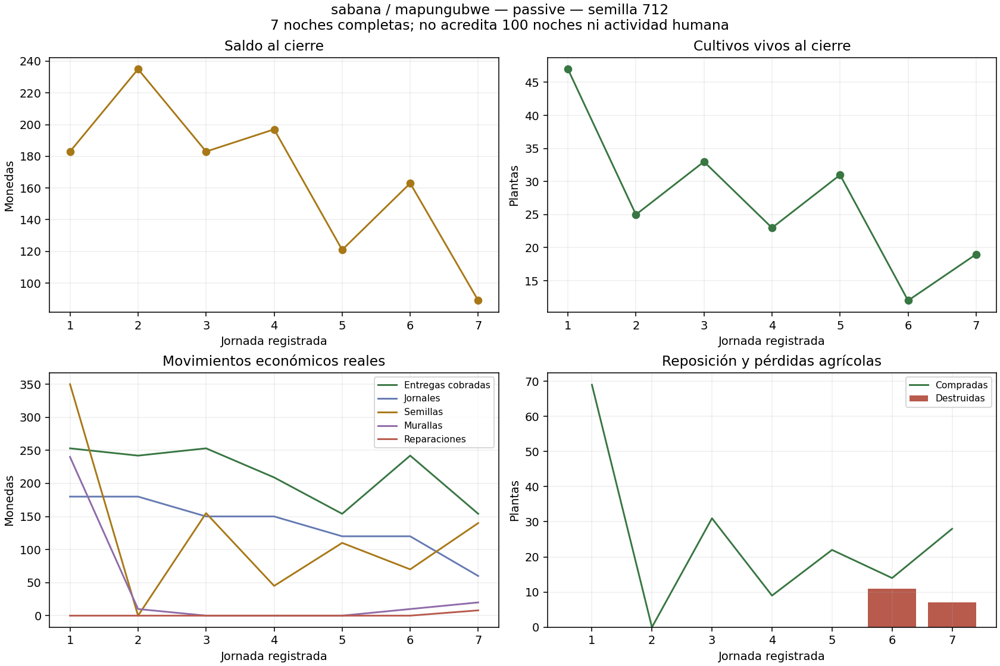

# Seed coverage and early passive defense: seven-night observations

No native balance/source changes. Seed-123 v83 and seed-2026 v84 use Q9 good management, moderate agricultural magic, cashflow crops, olderFemale, Sabana/Mapungubwe, shore zarzas from day six, rolling funding, breach-first repairs and 1.5 fluid clearance. v85 is a separate passive seed-712 diagnostic that starts defense on day **one** instead of six. Do not mix its timing change into the three-seed active cohort.

## Active cohort: identical sources and player policy

| Seed/case | Survived nights | Coins | Living plants | Crop losses | Wall coins | Repair coins | First complete contour |
|---|---:|---:|---:|---:|---:|---:|---|
| 712/v78 | 7 | 621 | 141 | 50 | 580 | 0 | Not yet |
| 123/v83 | 7 | 464 | 154 | 59 | 470 | 0 | Not yet |
| 2026/v84 | 7 | 615 | 191 | 17 | 530 | 0 | Day 7, 246 s |

`pilot-v78-v83-v84-seed-source-comparison.json` asserts identical **full** frozen source hashes, player policy, labour option and agricultural-magic mode. All three receipts are native observed horizons; seed differences remain genuine procedural/RNG variability. This is not statistical assurance or 100-night acceptance.

v83: `700 + 5324 - 1881 wages - 3209 seeds - 470 walls = 464`. Its 47 pieces leave a 340-coin unfinished quote. There are zero native wall contacts in the seven-night observation; incomplete geometry is not accepted as effective defense.

v84: `700 + 5822 - 1966 wages - 3411 seeds - 530 walls = 615`. Its 53-piece contour is recorded complete near the end of day seven; that night's 26 wall contacts cause 589 actual HP loss, with no additional plants destroyed on night seven. Repairs have not yet been paid at this horizon. Continue to fourteen nights to observe real maintenance, breach and stock rather than assuming completed geometry stays intact.

## Passive early-defense control

v85 survived seven nights with 89 coins, 19 plants, 18 destroyed plants, 28 paid wall pieces and eight real repair coins. Exact ledger: `700 + 1507 income - 960 wages - 870 seeds - 280 walls - 8 repairs = 89`. Its complete contour is first recorded at day seven, 294 s. Twenty wall contacts cause 420 HP loss; no centre contacts occur.

Unlike the day-six start, early wall spending materially changes the opening: first-day seeds bought fall to 69, 240 coins go to walls, then day two buys zero seeds. Living stock declines from 47 on day one to 19 on day seven; the full crew falls from six to two. The policy is not yet a viable growth example, but it now has closed geometry and a paid surviving crew. A fourteen-night recovery control is justified to determine whether it can recover without agricultural magic. Do not label this small farm sustainable, defeat-proof or below 25% inactivity.

All three new observations pass paired full-source terminal/ledger/delivery and plant-census audits, individual worker settlement and actual rolling allocation audits. Native snapshots, source manifests, daily rows and negatives are preserved. There is no synthetic removal, price change, free repair, advanced income or modified worker productivity. The graphs were visually checked for native terminal values and labels; they are not gameplay visual/GPU QA.

Next: fourteen-night extensions of the active 123/2026 cases and the early passive 712 case, each required to reproduce its complete seven-day prefix. The active 712 twenty-one-night campaign is still running at this checkpoint. Keep main unchanged until the broader native matrix, performance, persistence, human activity and 100/180-day gates are satisfied.
