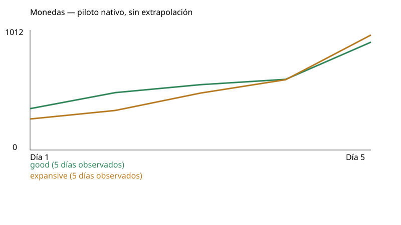
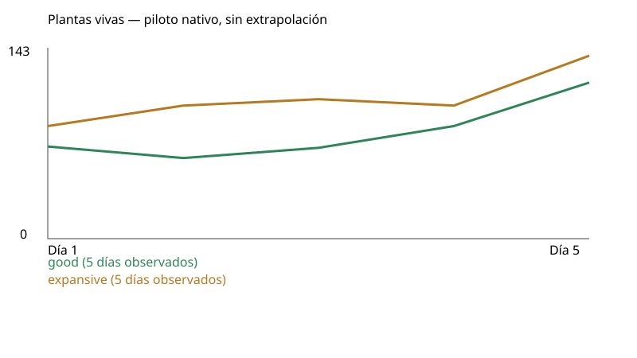

# Piloto nativo: resultados observados

| Estrategia | Semilla | Estado | Días completos | Dinero | Vivas | Ingresos | Gastos | Neto diario acumulado | Muros comprados | Golpes a muros | Inactividad |
|---|---:|---|---:|---:|---:|---:|---:|---:|---:|---:|---:|
| good | 712 | incomplete-harness-error | 5 | 949 | 122 | 5324 | 5075 | 249 | 40 | 0 | 59.80% |
| expansive | 712 | incomplete-harness-error | 5 | 1012 | 143 | 6106 | 5794 | 312 | 58 | 5 | 56.40% |

- good: incompleto en día 6, hora interna 600. Completed preparation has no valid whole-group entry; case incomplete
- expansive: incompleto en día 6, hora interna 600. Completed preparation has no valid whole-group entry; case incomplete

Completed native days only. Partial current day remains in original receipts. No extrapolation to100/180. Day1 opening already paid center800; cumulative operating net excludes that opening capital. Purchases include first hiring-trigger seed, unlike loop-only planted count. Additional wages are already in wages. Repair reference uses end-of-day living plants and is a hypothetical comparison only, never a fee; actual repairs include all structures. Activity uses native decisions plus once-credited paid HP-restoring requests when available; raw legacy activity is labeled separately. No GPU/touch/visual acceptance.

Las campañas comparten código y economía; sus decisiones pueden consumir RNG y modificar atracción. Compartir semilla no garantiza cohortes idénticas. Una compra de muro no acredita recinto cerrado ni protección eficaz.

