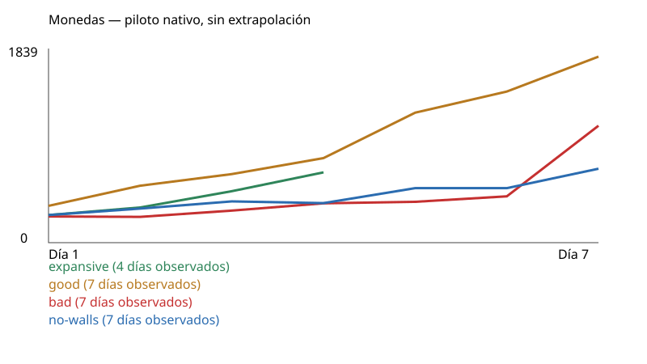
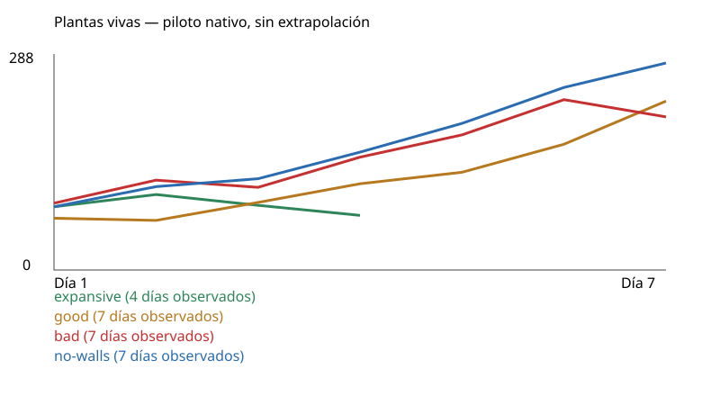

# Piloto nativo: resultados observados

| Estrategia | Semilla | Estado | Días completos | Dinero | Vivas | Ingresos | Gastos | Neto diario acumulado | Muros comprados | Golpes a muros | Inactividad |
|---|---:|---|---:|---:|---:|---:|---:|---:|---:|---:|---:|
| expansive | 712 | incomplete-harness-error | 4 | 695 | 76 | 3696 | 3701 | -5 | 34 | 0 | 64.67% |
| good | 712 | observed-horizon | 7 | 1839 | 235 | 10252 | 9113 | 1139 | 0 | 0 | 47.38% |
| bad | 712 | observed-horizon | 7 | 1156 | 213 | 6336 | 5880 | 456 | 0 | 0 | 64.38% |
| no-walls | 712 | observed-horizon | 7 | 731 | 288 | 7062 | 7031 | 31 | 0 | 0 | 57.67% |

- expansive: incompleto en día 5, hora interna 600. Completed preparation has no valid whole-group entry; case incomplete

Completed native days only. Partial current day remains in original receipts. No extrapolation to100/180. Day1 opening already paid center800; daily net excludes that opening capital. Purchases include first hiring-trigger seed, unlike loop-only planted count. Additional wages are already in wages. No GPU/touch/visual acceptance.

Las campañas comparten código y economía; sus decisiones pueden consumir RNG y modificar atracción. Compartir semilla no garantiza cohortes idénticas. Una compra de muro no acredita recinto cerrado ni protección eficaz.

