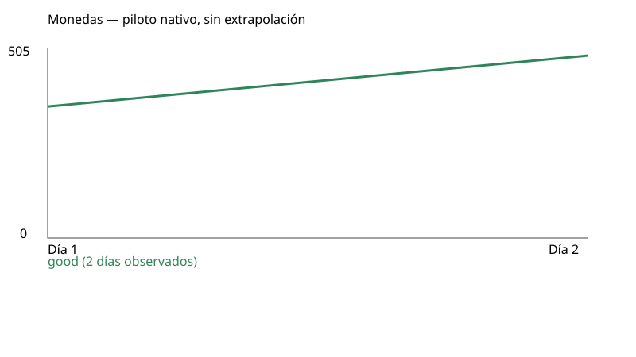
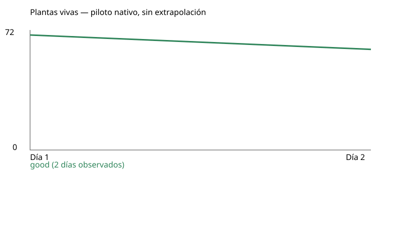

# Piloto nativo: resultados observados

| Estrategia | Semilla | Estado | Días completos | Dinero | Vivas | Ingresos | Gastos | Neto diario acumulado | Muros comprados | Golpes a muros | Inactividad |
|---|---:|---|---:|---:|---:|---:|---:|---:|---:|---:|---:|
| good | 712 | observed-horizon | 2 | 505 | 63 | 1485 | 1680 | -195 | 9 | 0 | 66.67% |

Completed native days only. Partial current day remains in original receipts. No extrapolation to100/180. Day1 opening already paid center800; daily net excludes that opening capital. Purchases include first hiring-trigger seed, unlike loop-only planted count. Additional wages are already in wages. No GPU/touch/visual acceptance.

Las campañas comparten código y economía; sus decisiones pueden consumir RNG y modificar atracción. Compartir semilla no garantiza cohortes idénticas. Una compra de muro no acredita recinto cerrado ni protección eficaz.

