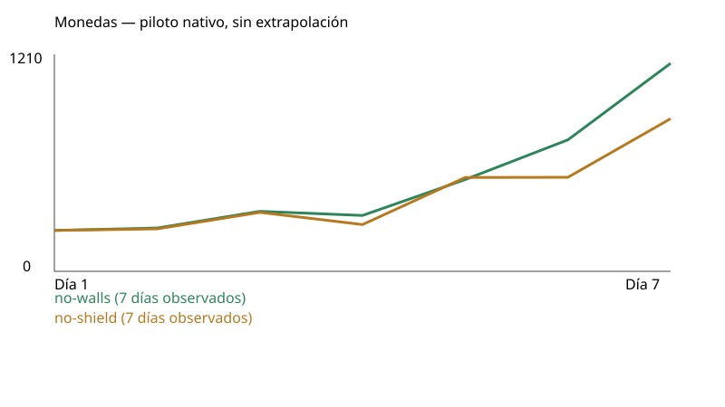
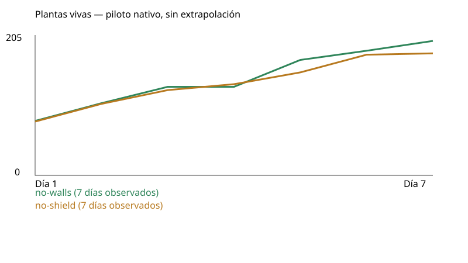

# Piloto nativo: resultados observados

| Estrategia | Contratación declarada | Fuente | Semilla | Estado | Días completos / solicitados | Dinero | Vivas | Ingresos | Gastos | Neto diario acumulado | Muros comprados | Golpes a muros | Inactividad |
|---|---|---|---:|---|---:|---:|---:|---:|---:|---:|---:|---:|---:|
| no-walls | q6 | 9b6858a5 | 712 | observed-horizon | 7 / 7 | 1210 | 205 | 6864 | 6354 | 510 | 0 | 0 | 62.05% |
| no-shield | q6 | 9b6858a5 | 712 | observed-horizon | 7 / 7 | 888 | 186 | 5104 | 4916 | 188 | 0 | 0 | 69.38% |

Completed native days only. Partial current day remains in original receipts. No extrapolation to100/180. Day1 opening already paid center800; cumulative operating net excludes that opening capital. Purchases include first hiring-trigger seed, unlike loop-only planted count. Additional wages are already in wages. Repair reference uses end-of-day living plants and is a hypothetical comparison only, never a fee; actual repairs include all structures. Activity uses native decisions plus once-credited paid HP-restoring requests when available; raw legacy activity is labeled separately. No GPU/touch/visual acceptance.

Consultar las fuentes, políticas y condiciones declaradas: esta tabla no acredita que campañas de versiones distintas compartan código o parámetros. Las decisiones pueden consumir RNG y modificar atracción; compartir semilla no garantiza cohortes idénticas. Una compra de muro no acredita recinto cerrado ni protección eficaz. Un control sin murallas puede conservar escudos; si ese permiso no está registrado, no se infiere de su nombre.

