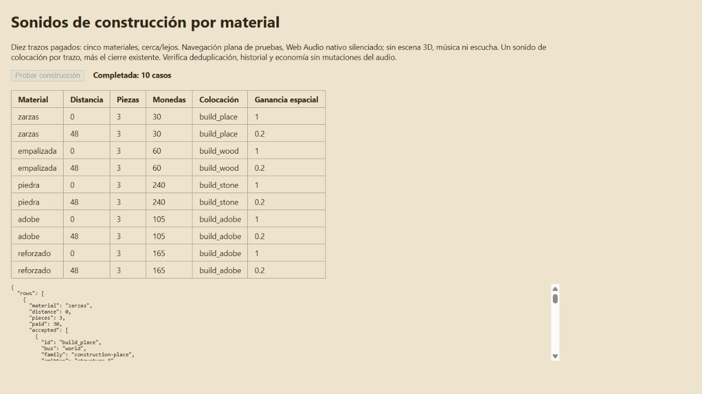

# Construcción de murallas — SFX 031/032/033

Se selecciona el sonido de colocación tras un `WallChainBuilt` confirmado y pagado: empalizada → 031 madera, piedra → 032 piedra, adobe/reforzado → 033 adobe. Zarzas y eventos antiguos sin material conservan 029. La variante sustituye al sonido genérico; se mantiene el cierre 034 existente, una vez por trazo y sin reproducir por cada módulo.

Ambos sonidos de construcción rechazan una descarga que termine más de medio segundo después del evento, al cerrar la escena o durante pausas de menú/ocultación/error. No se modifican eventos de simulación, precios, posiciones, FIFO, saldos ni el catálogo original de 126 archivos. Los índices Opus y sus hashes se regeneran sin recomprimir audio.

## Verificación

- 85 pruebas dirigidas y 137 ampliadas correctas; compilación y comprobación del paquete web correctas (587 archivos, 382.099.446 bytes, 859 enlaces relativos, 20 GLB).
- [Diez casos Web Audio nativos](native.json): cinco materiales × dos distancias, tres piezas pagadas por trazo. Se descodifican los Opus reales, se crean fuentes nativas y se verifica bus espacial, ganancia 1/0,2, deduplicación, historial silencioso, ausencia de mutaciones económicas y liberación de voces/contexto.
- Pruebas de rechazo, previsualización, saldo insuficiente, comando repetido, descarga tardía, ocultación y parada en `tests/wall-build-audio.test.js`.
- La matriz del catálogo registra ahora 88 asignados y 38 pendientes; los originales coinciden por hash.

La navegación de esta prueba es un doble plano. Web Audio se silencia deliberadamente: no acredita escucha subjetiva, escena 3D completa, móvil, Tauri ni rendimiento. Los logs comprimidos conservan sus bytes originales, con hashes en `logs.json`.

