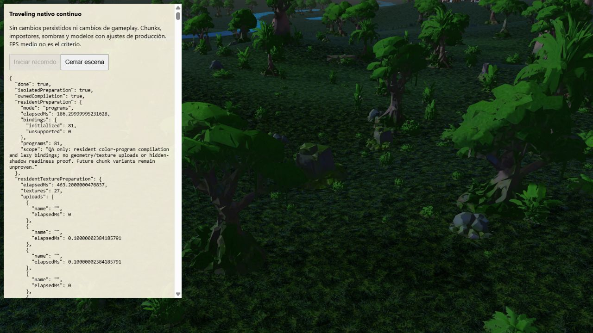

# Owned compiler: dense traveling AB/BA

Runtime `8b8afc6e`, native tabs 852–855, 8 October 2026. Each route travels
180 m in 15 seconds, seed 712, Gran Río/Suajili archived intensive farm,
quality media. Both arms use isolated upload draws and identical resident
program-only, texture and rigid-crate readiness. No full resident draw primer,
GL trace or buffer-binding resource probe. A uses Three's original compileAsync;
B enables the QA-only owned readiness compiler. No production activation.

| Order | Interval p95 ms | Interval max ms | Frames >100 ms | CPU max ms | GPU p95 ms |
|---|---:|---:|---:|---:|---:|
| A1 | 148.1 | 216.1 | 29 | 50.0 | 86.4 |
| B1 | 182.9 | 233.1 | 49 | 45.4 | 111.7 |
| B2 | 149.6 | 166.2 | 36 | 47.9 | 83.2 |
| A2 | 116.4 | 166.2 | 21 | 44.6 | 69.3 |

Percentiles use the fixture's nearest-rank convention. Recompute exact values
with `verify.mjs`; the table rounds to one decimal. Both B runs have worse
interval p95 and slow-frame count than both controls. The lifecycle fix is
therefore **not accepted for production performance** on this evidence.
GPU times vary substantially across the series; these four sequential runs
do not isolate a causal compiler slowdown from thermal/browser scheduling
or other uncontrolled conditions. No improvement is claimed and no run is
discarded. The route is still far from stable frame delivery in both arms.

All four retain identical farm/camera/device identity and serialized state;
34 actor requests were awaited, and each loads 15 new chunks (25 to 40), with
no failed chunks, fallbacks or reported errors. Every frame has a resolved
GPU query; no disjoint, foreign, skipped, allocation-failed or pending queries.
All scenes were disposed and tabs closed sequentially; final inventory empty.

The earlier four intensive CPU processes were no longer live before this
series (Win32_Process: no intensive node command). This differs from previous
traveling campaigns; do not pool their timings with these results. Cache and
thermal state were not controlled. These are rendering/lifecycle checks on
a paused historical farm, not current campaign gameplay acceptance, physical
RAM/VRAM evidence, or proof of transition continuity.

Raw DOM reports are losslessly gzipped with receipt hashes. The screenshot
is B2's endpoint before disposal, not a motion recording. The receipt includes
runtime/fixture hashes; the verifier checks archived integrity, query/state/
readiness identity and recomputes the statistics without rerunning WebGL.

Next: investigate the timing variation and remaining fence/frame-wait lifecycle
gaps before rerunning the candidate. Continue prioritizing reduced upload work
and measured scheduling improvements over an average-FPS claim.

