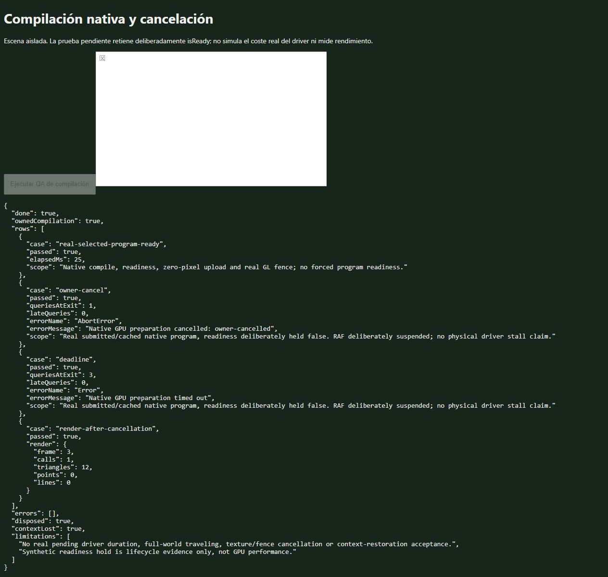

# Owned compilation: native lifecycle smoke

8 October 2026, native IAB tab 851, one graphics context at a time. Runtime
source `6496022e`; new fixture added in this evidence commit. Four intensive
CPU campaign processes remained live (41304, 41320, 48904, 49032).

`tests/browser/native-owned-compilation.html` submits a native Three renderer
and real selected program through `prepareNativeFarGpu` with the explicit
owned-compilation option. The ordinary ready case completes the real zero-pixel
upload and GL fence (25 ms observed; not a benchmark).

Cancellation and deadline cases deliberately retain the cached native program's
`isReady` result as false, and suspend the supplied RAF promise. Both reject
with the expected reason and show zero later readiness queries during a 40-ms
observation. The original method is restored. A final real draw succeeds, then
the fixture disposes its material, geometry, renderer cache and context. The
report records no errors and a lost context; the tab was closed and browser
inventory was empty before releasing the GPU to the loading feature agent.

This proves the direct native integration and bounded polling under a
controlled pending condition. It does not measure a real stalled driver,
full-world shader recipes, traveling performance, physical memory, context
restoration, or cancellation of texture/decode/fence waits. Those gates remain
open. Production still does not set `farOwnedCompilation`.

The receipt hashes the raw DOM report, screenshot and local runtime/fixture
sources. `node docs/qa/streaming-travel-dense/owned-compilation-native/verify.mjs`
checks receipt integrity and reported invariants; it does not rerun WebGL.

