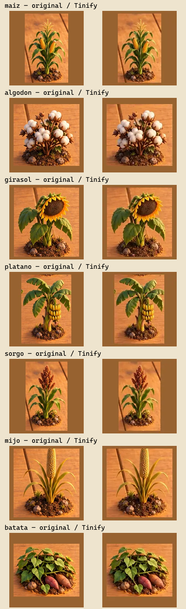

# Siete miniaturas de cultivos — pilotos Tinify

Candidatos fuera de producción sobre `51d204cf`. Yuca ya utiliza una variante
integrada anteriormente; este lote cubre maíz, algodón, girasol, plátano, sorgo,
mijo y batata. Se conservan originales independientes en este archivo y en
`public/assets`; ningún alias ni manifiesto runtime cambia.

Las siete llamadas reales a Tinify producen 35.464 bytes frente a 65.746 bytes
originales: **30.282 bytes de ahorro potencial (46,06%)**. Todos conservan 192×192
y cero diferencias de alpha al descodificar RGBA8 con Sharp. El RGB cambia:
error absoluto medio 2,76–4,01 en escala 0–255, máximo individual 46. Estos
números describen la compresión con pérdida y no constituyen un umbral de
aceptación visual ni una prueba de igualdad de color.

El root revisó `comparison.png`: en ese contacto a tamaño nativo se conserva
la composición, escala, forma y legibilidad general de los siete cultivos.
La revisión es de imágenes descodificadas con Sharp, no de un panel real en
Chrome, móvil o Tauri. Quedan la comparación de descodificación nativa,
revisión dentro del menú y carga desde el paquete anidado antes de integrar.
No se mide RAM, CPU, GPU ni FPS. La ventana ABBA de carga se mantiene separada.

`node docs/qa/tinify-crop-thumbnail-pilots/verify.mjs` recomputa hashes, dimensiones,
alpha y métricas RGB de cada par y comprueba los recibos originales
`acceptedForRuntime:false`. No contacta con Tinify ni necesita credenciales.
Las ubicaciones privadas del proveedor y la credencial permanecen fuera de Git.
El fixture preparado `tests/browser/crop-thumbnail-pilots.html` descodifica
mediante Image/canvas y muestra los siete pares; está preparado, todavía no
ejecutado en este archivo de evidencia. No se interpreta su mera existencia
como prueba de aceptación.

