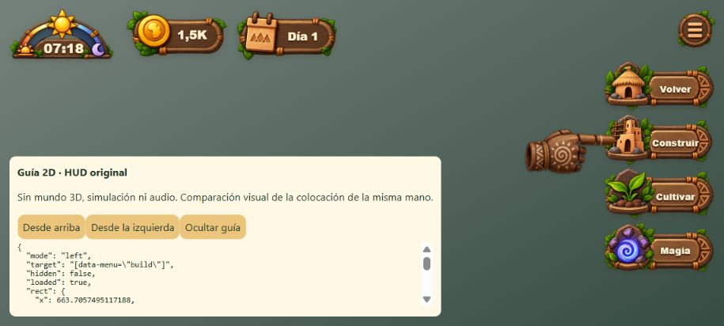
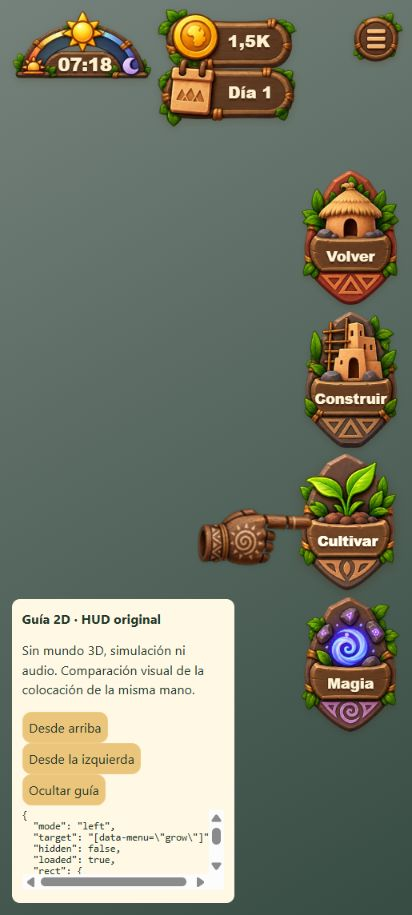

# Indicación 2D: evitar confusión con el botón anterior

En el HUD original, una mano de 92 px apuntando hacia abajo a Construir colocaba su cuerpo sobre Volver. El recurso estaba cargado y habilitado; visualmente podía confundirse con la decoración de madera del botón anterior. La comparación aislada reproduce ese encuadre en `above-desktop.jpg`.

La guía actual usa el mismo recurso original, con 116 px de ancho y sin rotación. Señala desde la izquierda hacia el icono del botón correspondiente, dejando legible su etiqueta y libre la acción anterior. La oscilación CSS se desplaza cinco píxeles horizontalmente; se conserva la preferencia de movimiento reducido y `pointer-events:none`. No se alteran condiciones del tutorial, pausas, selección, reglas, recursos 3D ni manos del mundo.

## Verificación

- 19 pruebas dirigidas de la secuencia del tutorial y las manos originales pasan, incluidos repetición en una segunda partida, cierre, timeout automático, objetivos legales y eliminación de guías al completar acciones.
- `tests/browser/tutorial-hud-hand.html` utiliza el HUD, recursos, layout y clase de mano reales. La vista lateral usa el código de producción. La referencia anterior solo sobrescribe coordenadas/rotación en esta página aislada. Sin simulación, audio ni escena 3D.
- [Cuatro estados visibles y uno oculto](native.json) obtenidos con CUA: Construir a 1280×720, 915×412 y 412×915; Cultivar a 412×915; ocultación explícita. Recurso cargado, rectángulos dentro del viewport y retirada efectiva. El clic en Cultivar sigue llegando al botón mientras la guía está presente. Viewport restablecido y pestaña propia cerrada.
- Compilación y paquete web comprobados; los logs originales comprimidos y sus hashes se conservan junto a este informe.

Pendientes: aceptación completa de gestos 3D y su transición en juego, otras dimensiones/idiomas, móvil físico y mediciones de rendimiento. Esta prueba no completa el sistema de manos ni demuestra FPS.

