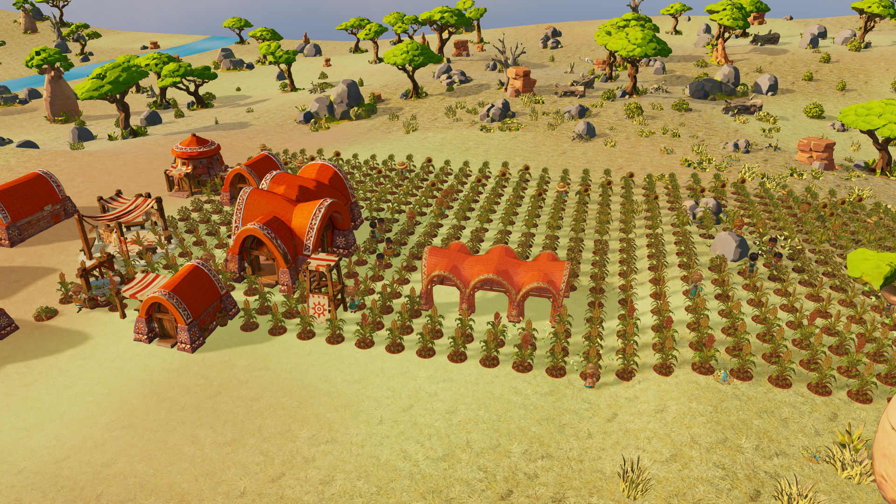
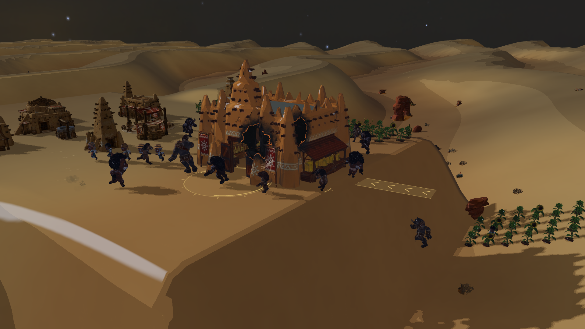
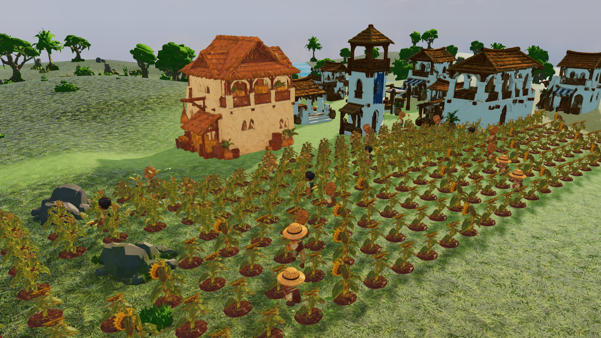
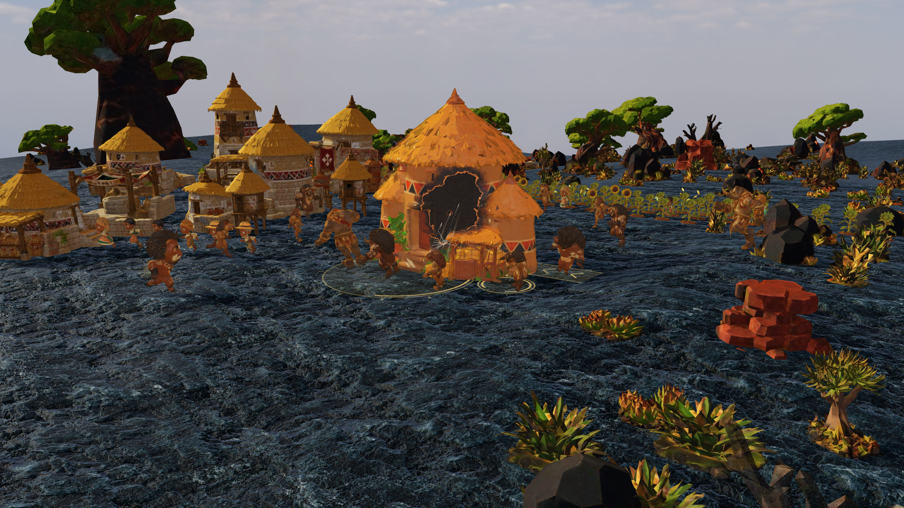
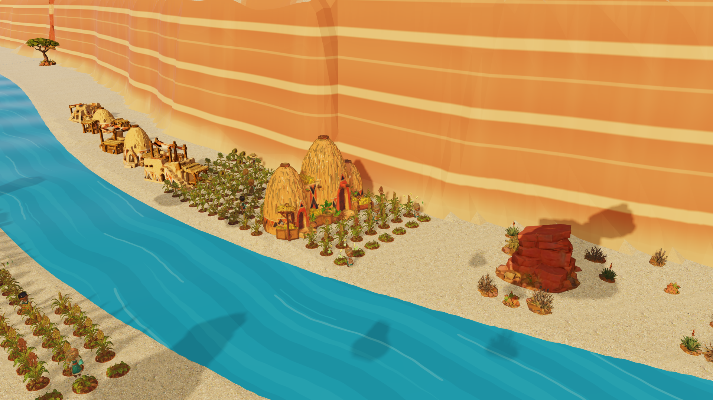

# Wild Guardians Africa — 15 capturas del motor

Capturas PNG a **1920 × 1080**, sin interfaz, tomadas directamente del canvas WebGL del juego. Calidad **alta**, antialiasing, sombras de 2048 px y máxima distancia disponible en el motor: **49 sectores residentes (7 × 7)** y plano lejano de cámara a **500 unidades**. No se han reescalado, retocado ni generado con IA.

Son escenas preparadas con dirección de cámara: se conceden recursos de preparación y se fijan crecimiento, tareas, poses de animación e incursiones. No documentan una campaña jugada de principio a fin. Se utilizan `WorldScene`, terreno procedural, modelos, materiales, animaciones y efectos de producción, sin modificar el renderizador. Las cantidades indican entidades de la escena; algunas quedan ocultas por terreno, vegetación o edificios.

Colección: **cinco principales, cinco de reserva y cinco primeros planos**. [Abrir la galería local](gallery.html) para comparar las 15 y marcar favoritas. Los primeros planos usan una cámara fotográfica con objetivo de 30° (36° para la pareja), manteniendo la resolución y calidad del mundo.

## 01 — La gran cosecha

Sabana / Mapungubwe · día · 420 cultivos y 32 trabajadores regando, cosechando y transportando cajas. Vista elevada sobre las hileras y las construcciones de tejados rojos.

## 02 — Asedio bajo las estrellas

Desierto / Saheliana · noche · 15 bestias de cinco especies, cinco ataques simultáneos contra el centro dañado y trabajadores huyendo. Dunas y arquitectura de adobe en el fondo.

## 03 — Trabajo entre las hileras

Gran Río / Suajili · día · 240 cultivos y 24 trabajadores. Cámara próxima a las tareas agrícolas, con el poblado blanco como fondo.

## 04 — La casa resiste

Volcanes / Etíope · día · 15 bestias de cinco especies y 12 trabajadores. Ataque múltiple contra un centro dañado, con animaciones y marcas de impacto nativas sobre el terreno volcánico.

## 05 — Cultivar el cañón

Gran Cañón / Musgum · día · 200 cultivos y 24 trabajadores. Composición diagonal siguiendo el río, bajo las paredes estratificadas del cañón.

## Reservas

| Nº | Captura | Escena |
|---|---|---|
| 06 | [Manglares](06-reserva-manglares.png) | Agricultura suajili entre agua y raíces; 20 trabajadores |
| 07 | [Escudo nocturno](07-reserva-escudo-nocturno.png) | Barrera nativa protegiendo el centro durante el asedio |
| 08 | [A las puertas](08-reserva-bestias-primer-plano.png) | Ángulo bajo y cercano del ataque en volcanes |
| 09 | [A pie de campo](09-reserva-cosecha-a-pie-de-campo.png) | Trabajadores entre girasoles, con la aldea de fondo |
| 10 | [Río entre paredes](10-reserva-rio-entre-paredes.png) | Perspectiva longitudinal de ambas orillas del cañón |

## Primeros planos

| Nº | Captura | Protagonista |
|---|---|---|
| 11 | [Rinoceronte](11-detalle-rinoceronte.png) | Bestia avanzando en terreno volcánico |
| 12 | [León](12-detalle-leon.png) | Bestia en plena incursión sobre la sabana |
| 13 | [Búfalo e hiena](13-detalle-bufalo-hiena.png) | Pareja de atacantes frente a la arquitectura saheliana |
| 14 | [Amara cosechando](14-detalle-amara-cosechando.png) | Animación de cosecha original |
| 15 | [Kofi regando](15-detalle-kofi-regando.png) | Regadera y animación de riego originales |

## Reproducir

Desde la raíz del repositorio, iniciar `npm run dev -- --port 5178`. Abrir `/snapshots/studio.html?shot=0` (índices del 0 al 14), o ejecutar `node snapshots/capture.mjs` con Playwright disponible. `PLAYWRIGHT_MODULE` permite indicar la ruta a una instalación de Playwright sin añadir dependencias al juego. Se requiere Chromium instalado para esa versión de Playwright. Se puede capturar una selección mediante `node snapshots/capture.mjs 1 3`.

Cada JSON conserva resolución, semilla, reloj, calidad, sectores cargados, cantidades de entidades y coordenadas finales de cámara. La herramienta espera la carga de todos los actores y sectores antes de capturar. Las imágenes se revisan visualmente y sus dimensiones se verifican leyendo los PNG.
